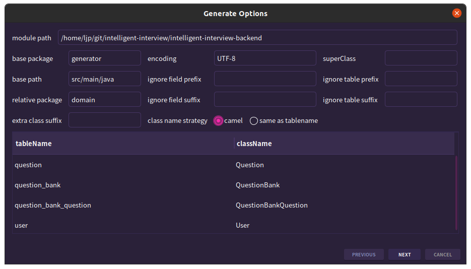
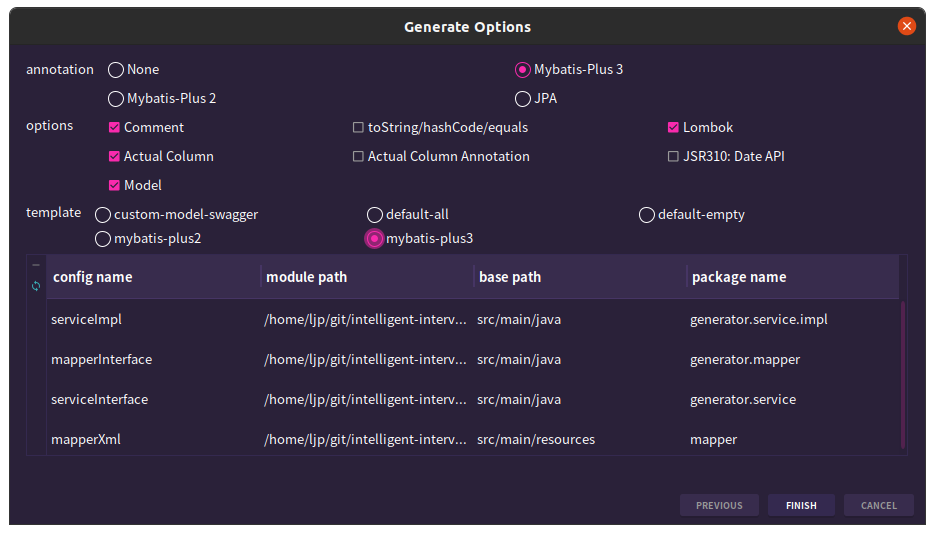

# 后端开发

## 初始化本项目

初始化项目，并且创建 `git` 仓库进行托管。


添加业务无关代码（使用 `MybatisX` 给数据库添加增删查改代码）





迁移实体和 `mapper`，然后 `service/` 不要使用代码生成器来生成，因此迁移后删除 `generator/` 即可。

使用代码生成器来快速迁移对应的文件...

修改自动生成的代码，尤其是根据实体类 `entity/` 来修改请求包装类 `dto/` 和响应包装类 `vo/`。


编写业务无关接口 `controller/impl/`，运行初始化项目。


修改 `xml` 问题...


修改 `Test` 文件。


删除冗余的文件。

## 编写业务接口

梳理所有接口，确认和完善接口，补充新的接口。

*   [x] 用户接口
    *   [x] 普通用户注册
    *   [x] 普通用户登录
    *   [x] 管理员对用户增删改查

*   [ ] 题库接口
    * [x] 普通用户查看题库列表（分页查看）
    
    * [x] 普通用户查看题库详情（展示题库下的题目，并且题目的部分详情信息也是需要展示出来的）

      > 【需要手动开发：根据题库 id 查询题目的详情，并且可能需要题目列表，因此用一个字段来表示是否要关联查询题目列表，复用下面的管理员按照题库查询旗下的所有题目列表提取出来的 service 即可】
    
    *   [x] 管理员对题库增删改查
    
*   [ ] 题目接口
    *   [x] 普通用户搜索题目（分页查看）
    
    *   [x] 普通用户查看题目详情（进入刷题页面）
    
    *   [x] 管理员对题目增删改查

    *   [x] 管理员按照题库查询旗下的所有题目列表
    
        >   【需要手动开发：由于我们只有题库题目关联表，因此就需要从这个表中根据题库 id 来获取相同题库 id 的所有题目，再根据题目 id 获取题目的信息，可以联表做笛卡尔积查询（简单但是不利于拓展，最好开发中不要这么写，效率可能高但是不够灵活，写到业务层中会好一点，也就是不用 SQL 用代码写，尽管性能不一定高但是灵活（方便后期做细筛选）。先把查询到的同一个题库 id 下的所有题目 id 获取到一个集合中，然后根据题目 id 在题目表中使用 in 查询，找到对应的题目记录。）因此这里选择第二种方式，不过如果要考虑对题目题库关联表和题目表同时进行查询和分页，那么就可以使用 SQL join 也就是第一种方式进行实现，因为业务层处理多分页比较麻烦】
    
    *   [ ] 管理员修改题目所属题库
    
        >   【需要手动开发：如果题目未加入该题库，就往题库题目关联表中添加一条记录；如果已经加入该题库，就需要将该记录删除，这还是比较简单的，只要做好异常处理即可（数据库已经做了唯一性约束，这样就不需要自己做加锁，分布式数据库还要加分布锁）】
    
*   [ ] 高级功能
    *   [ ] 题目批量管理（可能需要增加题目总数统计，需要）
    *   [ ] 分词题目搜索
    *   [ ] 用户刷题记录日历图
    *   [ ] 自动缓存热门题目
    *   [ ] 网站流量控制和熔断
    *   [ ] 动态 `IP` 黑白名单过滤
    *   [ ] 同端登录冲突检测
    *   [ ] 分级题目反爬虫策略
    *   [ ] 被删除记录的冷存策略和备份回溯机制
    *   [ ] 会员机制


理解数据库过程

可以把 `Service` 理解为一个**专门处理业务逻辑的“中介”类**，它负责协调客户端请求和底层数据库之间的互动。用 C++ 来类比的话，可以想象我们有以下几个类：

1. **实体类（`Entity` 类）**

   这相当于一个**数据结构**，主要是保存信息，并不执行复杂操作。比如在 C++ 中：

   ```cpp
   struct User {
       int id;
       std::string name;
       std::string email;
   };
   ```

2. **数据访问层（`Mapper` 类）**

   类似于一个**数据库接口类**，负责与数据库打交道、执行 SQL 查询、插入、更新、删除等。可以理解为数据库的“代理人”。

   ```cpp
   class UserMapper {
   public:
       User selectById(int id) {
           // 模拟从数据库获取数据
           return {id, "John Doe", "john@example.com"};
       }

       void insert(const User& user) {
           // 模拟插入数据到数据库
       }
   };
   ```

3. **服务层（`Service` 类）**

   `Service` 类就像一个**负责处理业务逻辑的“经理”类**。它不直接与数据库交互，而是通过 `Mapper` 来进行数据操作，业务逻辑都在这里进行。比如：

   - 验证用户数据
   - 处理事务
   - 组合多步数据库操作

   ```cpp
   class UserService {
   private:
       UserMapper userMapper;

   public:
       User getUserById(int id) {
           User user = userMapper.selectById(id);
           // 假设在这里验证用户数据或应用其他业务逻辑
           if (user.id == 0) {
               throw std::runtime_error("User not found");
           }
           return user;
       }

       void addUser(const User& user) {
           // 可以在此执行一些复杂的业务逻辑
           if (user.name.empty()) {
               throw std::runtime_error("Username cannot be empty");
           }
           userMapper.insert(user); // 调用 Mapper 执行数据库操作
       }
   };
   ```

4. **控制器层（`Controller` 类）**

   这部分主要用于处理用户请求（在 Web 应用中，这通常是网络请求），然后调用 `Service` 层的方法来完成实际操作。

   ```cpp
   class UserController {
   private:
       UserService userService;
   
   public:
       void handleGetUserRequest(int userId) {
           try {
               User user = userService.getUserById(userId);
               // 模拟返回用户数据给前端
               std::cout << "User found: " << user.name << std::endl;
           } catch (const std::exception& e) {
               std::cerr << e.what() << std::endl;
           }
       }
   };
   ```

在这个架构中，`Service` 层是业务逻辑的核心，负责协调和处理各项请求。直接与数据库交互的细节由 `Mapper` 层管理，而 `Controller` 只是简单地传递请求，把业务逻辑的重任交给了 `Service`。

# 前端开发

能够静态就使用静态部署。

CSR（客户端渲染）-> SPA（单页应用）

SSR（服务端预渲染）-> SSG（全量静态预渲染）（服务端预渲染）-> ISR（增量静态预渲染）（服务端预渲染）

PPR（部分预渲染）水合 -> 同构渲染，是一种将服务器端渲染（SSR）与客户端渲染（CSR）结合起来的技术。它允许在服务器和客户端之间共享代码，从而在不同环境中渲染相同的组件（同一套代码可以在服务端和客户端运行，包括页面更新也不用过于依赖服务器）

VuePress 或者 Astor 搭建个人博客。

https://nextjs.org/learn/dashboard-app

openapi

全局状态管理 Redux


Slice

# 部署上线


# 回顾项目

