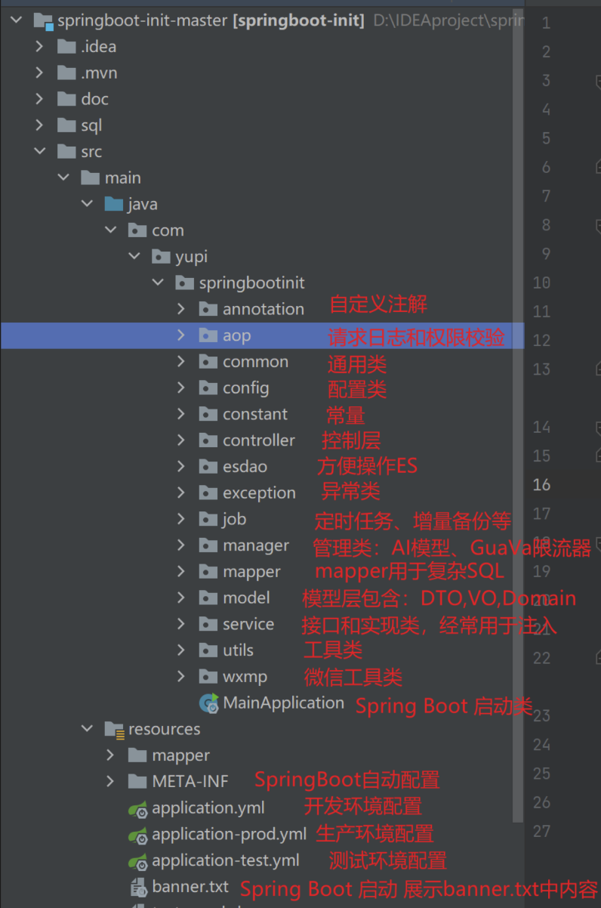
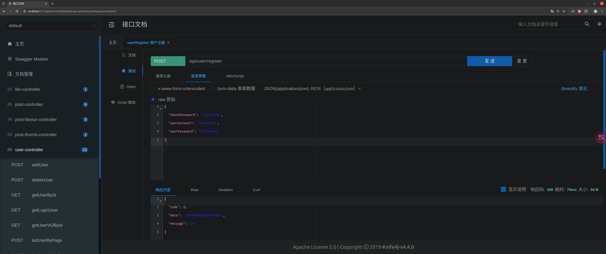
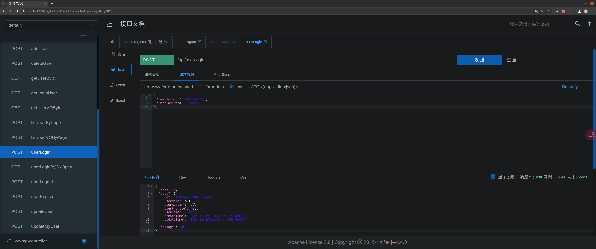
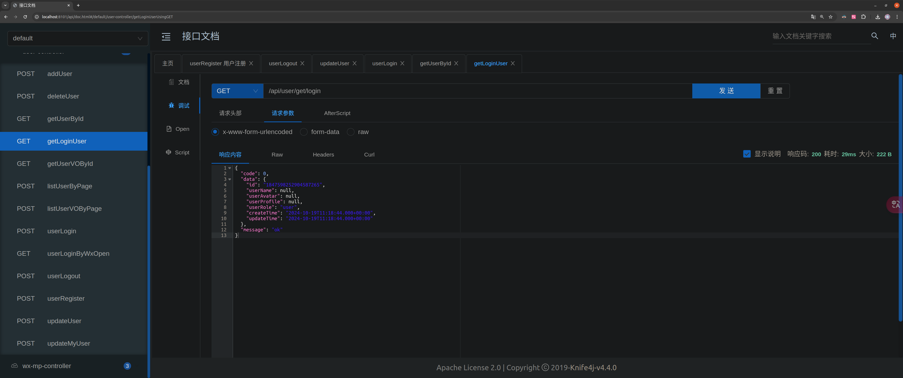

# 1.开发环境

## 1.1.系统约定

本项目开发完成后，需要基于镜像文件 `ubuntu:20.04, mysql:8.0.39` 开发以下镜像文件：

- `limou3434/intelligent-interview-backend-in-ubuntu:latest` 内部需要有基础的系统工具和系统服务，存储项目的源代码（内部允许存在一个本地数据库交给程序员进行容器测试），可执行可部署文件（方便后期一键部署）
- `limou3434/intelligent-interview-database-in-ubuntu:latest` 内部需要有基础的数据库配置和少量的数据（方便后期一键部署）

## 1.2.软件约定

这里列出技术清单，并且方便进行下载。

```shell
# 相关组件版本
java==openjdk-8-jdk/openjdk-11-jdk
mysql==8.0.39
maven==3.8.1
docker==27.3.1
es==...
redis==...

```

# 2.功能模块

根据之前的需求分析，这里列出我们要实现的功能，并且

对下列任务进行优先级标记，其中：

*   `P0` 为必做核心
*   `P1` 为重点功能
*   `P2` 为实用功能
*   `P3` 可做可不做

## 2.1.基础功能开发模块

*   用户模块 `P0`
    *   **普通用户** 注册和登录
    *   **管理员用户** 管理普通用户（增删改查）
*   题库模块 `P0`
    *   **普通用户** 查看题库列表
    *   **普通用户** 查看题库详情（展示题库下的题目）
    *   **管理员用户** 管理题库（增删改查）
*   题目模块 `P0`
    *   **普通用户** 搜索题目
    *   **普通用户** 查看题目详情（进入刷题页面）
    *   **管理员用户** 管理题目（增删改查）

## 2.2.高级功能开发模块

*   题目批量管理 `P1`
*   分词题目搜索 `P1`
*   用户刷题记录日历图 `P2`
*   自动缓存热门题目 `P2`
*   网站流量控制和熔断 `P2`
*   动态 `IP` 黑白名单过滤 `P2`
*   同端登录冲突检测 `P2`
*   分级题目反爬虫策略 `P2`
*   被删除记录的冷存策略和备份回溯机制 `P3`
*   会员机制 `P3`

# 3.后端设计

## 3.1.库表设计

库表的设计是围绕功能而来的，项目库名规定为 `intelligent_interview`，内部具有以下的数据表。

#### 3.1.用户表

```mysql
-- 用户表
create table if not exists user
(
    id           bigint auto_increment comment 'id' primary key,
    userAccount  varchar(256)                           not null comment '账号',
    userPassword varchar(512)                           not null comment '密码',
    unionId      varchar(256)                           null comment '微信开放平台 id',
    mpOpenId     varchar(256)                           null comment '公众号 openId',
    userName     varchar(256)                           null comment '用户昵称',
    userAvatar   varchar(1024)                          null comment '用户头像',
    userProfile  varchar(512)                           null comment '用户简介',
    userRole     varchar(256) default 'user'            not null comment '用户角色: user/admin/ban',
    editTime     datetime     default CURRENT_TIMESTAMP not null comment '编辑时间',
    createTime   datetime     default CURRENT_TIMESTAMP not null comment '创建时间',
    updateTime   datetime     default CURRENT_TIMESTAMP not null on update CURRENT_TIMESTAMP comment '更新时间',
    isDelete     tinyint      default 0                 not null comment '是否删除',
    index idx_unionId (unionId)
) comment '用户' collate = utf8mb4_unicode_ci;

```

>   [!WARNING]
>
>   注意：字段解释
>
>   其中 `unionId, mpOpenId` 是为了实现公众号登录的，也可以省略。每个微信用户在同一家公司主体的 `unionId` 是唯一的，在同一个公众号的 `mpOpenId` 是唯一的。但是一样`id` 值一般是不同的，可重用性比较低（微信号可以方便用户登陆同一家公司的不同产品时，就可以方便使用这个 `unionId` 对用户所用的产品进行分析，因此也最好使用这个字段作为唯一索引）。
>
>   `editTime` 和 `updateTime` 的区别是，`editTime` 表示用户编辑个人信息的时间（需要业务代码来更新），而 `updateTime` 表示这条用户记录任何字段发生修改的时间（由数据库自动更新）。
>
>   上述也采用了经典的一个设计，也就是 `编辑时间、创建时间、更新时间、是否删除` 这四个字段几乎后续设计的表都有，其中如果被删除的字段较多可以将标记为删除的记录放入备份表（也就是冷存）中进行存储（遵循“包含被删除数据在内的所有数据都是有价值”的原则，以防后续也需要对这些数据进行分析，提高可拓展性。另外，也可以考虑到备份和回溯的问题，项目不大时可以考虑不做）。

>   [!IMPORTANT]
>
>   补充：字段拓展
>
>   1.   如果要实现会员功能，可以对表进行如下扩展（也可以考虑拓展到头来`ssvip`）：
>
>        -   给 `userRole` 字段新增枚举值 `vip`，表示会员用户，可根据该值判断用户权限
>
>        -   新增 `vipExpireTime` 会员过期时间字段，可用于记录会员有效期
>
>        -   新增 `vipCod` 会员兑换码字段，可用于记录会员的开通方式
>
>        -   新增 `vipNumber` 会员编号字段，可便于定位用户并提供额外服务，并增加会员归属感（类似贴吧等网站的等级制度）
>
>            ```mysql
>            -- 拓展会员功能
>            vipExpireTime datetime     null comment '会员过期时间',
>            vipCode       varchar(128) null comment '会员兑换码',
>            vipNumber     bigint       null comment '会员编号'
>            ```
>
>   2.   如果要实现用户邀请功能，可以对表进行如下扩展：
>
>        -   新增 `shareCode` 分享码字段，用于记录每个用户的唯一邀请标识，可拼接到邀请网址后面，比如 `{base_url}?shareCode=xxx`
>
>        -   新增 `inviteUser` 字段，用于记录该用户被哪个用户邀请了，可通过这个字段查询某用户邀请的用户列表
>
>            ```mysql
>            -- 拓展分享功能
>            shareCode     varchar(20)  DEFAULT NULL COMMENT '分享码',
>            inviteUser    bigint       DEFAULT NULL COMMENT '邀请用户 id'
>            ```
>

#### 3.2.题库表

```mysql
-- 题库表
create table if not exists question_bank
(
    id          bigint auto_increment comment 'id' primary key,
    title       varchar(256)                       null comment '标题',
    description text                               null comment '描述',
    picture     varchar(2048)                      null comment '图片',
    userId      bigint                             not null comment '创建用户 id',
    editTime    datetime default CURRENT_TIMESTAMP not null comment '编辑时间',
    createTime  datetime default CURRENT_TIMESTAMP not null comment '创建时间',
    updateTime  datetime default CURRENT_TIMESTAMP not null on update CURRENT_TIMESTAMP comment '更新时间',
    isDelete    tinyint  default 0                 not null comment '是否删除',
    index idx_title (title)
) comment '题库' collate = utf8mb4_unicode_ci;

```

>   [!WARNING]
>
>   注意：字段解释
>
>   其中 `picture` 存储的是图片的 `url` 地址，而不是完整图片文件。通过 `userId` 和用户表关联，在本项目中只有管理员才能创建题库。
>
>   由于用户很可能按照标题搜索题库，所以给 `title` 字段增加索引。
>
>   这里由于 `title` 字段可能过长，就需要使用 `text` 字段，但是这个字段也是有限制的，因此可以使用更大的或者干脆给用户做限制。而由于其 `title` 的区分度和常索性较大，故以该字段为索引。

>   [!IMPORTANT]
>
>   补充：字段拓展
>
>   1.   如果要实现题库审核功能，可以对表进行如下扩展
>
>        -   新增审核状态字段，用枚举值表示待审核、通过和拒绝
>
>        -   新增审核信息字段，用于记录未过审的原因等
>
>        -   新增审核人 `id` 字段，便于审计操作，比如出现了违规内容过审的情况，可以追责到审核人
>
>        -   新增审核时间字段，也是便于审计
>
>            ```mysql
>            -- 拓展审核功能
>            reviewStatus  int      default 0  not null comment '状态：0-待审核, 1-通过, 2-拒绝',
>            reviewMessage varchar(512)        null comment '审核信息',
>            reviewerId    bigint              null comment '审核人 id',
>            reviewTime    datetime            null comment '审核时间'
>            ```
>
>   2.   如果要实现题库排序功能，可以新增整型的优先级字段，并且根据该字段排序。该字段还可以用于快速实现题库精选和置顶功能，比如 `优先级 = 1000` 的题库表示 `精选`，`优先级 = 10000` 的题库表示 `置顶`。
>
>        ```mysql
>        -- 拓展排序功能
>        priority  int  default 0  not null comment '优先级'
>        ```
>
>   3.   如果要实现题库浏览功能，可以新增题库浏览数字段，每次进入题目详情页时该字段的值 `+1`，还可以根据该字段对题库进行排序。而如果人数过多，就可以使用类似 `99999+` 这种写法。
>
>        ```mysql
>        -- 拓展题目浏览功能
>        viewNum  int  default 0  not null comment '浏览量'
>        ```
>

#### 3.3.题目表

```sql
-- 题目表
create table if not exists question
(
    id         bigint auto_increment comment 'id' primary key,
    title      varchar(256)                       null comment '标题',
    content    text                               null comment '内容',
    tags       varchar(1024)                      null comment '标签列表(json 数组)',
    answer     text                               null comment '推荐答案',
    userId     bigint                             not null comment '创建用户 id',
    editTime   datetime default CURRENT_TIMESTAMP not null comment '编辑时间',
    createTime datetime default CURRENT_TIMESTAMP not null comment '创建时间',
    updateTime datetime default CURRENT_TIMESTAMP not null on update CURRENT_TIMESTAMP comment '更新时间',
    isDelete   tinyint  default 0                 not null comment '是否删除',
    index idx_title (title),
    index idx_userId (userId)
) comment '题目' collate = utf8mb4_unicode_ci;

```

>   [!WARNING]
>
>   注意：字段解释
>
>   1.  题目标题 `title` 和题目创建人 `userId` 是常用的题目搜索条件，所以都添加索引提升查询性能
>   2.  题目可能有多个标签，为了简化设计，没有采用关联表，而是以 `JSON` 数组字符串的方式存储，比如 `["Java", "Python"]`
>   3.  题目内容（详情）和题目答案可能很长，所以使用 `text` 类型

>   [!IMPORTANT]
>
>   补充：字段拓展
>
>   1.   如果要实现题目审核功能，可以参考上述题库审核功能，新增 `4` 个字段即可
>
>        ```mysql
>        -- 拓展题目审核功能
>        reviewStatus  int      default 0  not null comment '状态：0-待审核, 1-通过, 2-拒绝',
>        reviewMessage varchar(512)        null comment '审核信息',
>        reviewerId    bigint              null comment '审核人 id',
>        reviewTime    datetime            null comment '审核时间'
>        ```
>
>   2.   可能有很多评价题目的指标，比如浏览数、点赞数、收藏数，参考字段
>
>        ```mysql
>        -- 拓展题目评价指标功能
>        viewNum       int      default 0    not null comment '浏览量',
>        thumbNum      int      default 0    not null comment '点赞数',
>        favourNum     int      default 0    not null comment '收藏数'
>        ```
>
>   3.   如果要实现题目排序、精选、置顶功能，可以参考上述题库表的设计，新增整型的优先级字段，并且根据该字段排序
>
>        ```sql
>        -- 拓展题目排序、精选、置顶功能
>        priority  int  default 0  not null comment '优先级'
>        ```
>
>   4.   如果题目是从其他网站或途径获取到的，担心有版权风险，可以增加题目来源字段，最简单的实现方式就是直接存来源名称
>
>        ```mysql
>        -- 拓展题目来源功能
>        source   varchar(512)  null comment '题目来源'
>        ```
>
>   5.   如果想设置部分题目仅会员可见，可以给题目表加上一个 “是否仅会员可见” 的字段，本质上是个布尔类型，用 `1` 表示仅会员可见
>
>        ```mysql
>        -- 拓展题目会员可见功能
>        needVip  tinyint  default 0  not null comment '仅会员可见(1 表示仅会员可见)'
>        ```

#### 3.4.题库题目关系表

```mysql
-- 题库题目表
create table if not exists question_bank_question
(
    id             bigint auto_increment comment '添加题目的用户 id' primary key,
    questionBankId bigint                             not null comment '题库 id',
    questionId     bigint                             not null comment '题目 id',
    userId         bigint                             not null comment '创建用户 id',
    createTime     datetime default CURRENT_TIMESTAMP not null comment '创建时间',
    updateTime     datetime default CURRENT_TIMESTAMP not null on update CURRENT_TIMESTAMP comment '更新时间',
    UNIQUE (questionBankId, questionId)
) comment '题库题目' collate = utf8mb4_unicode_ci;

```

>   [!WARNING]
>
>   补充：字段解释
>
>   1.  上述代码中的 `userId` 表示添加题目到题库的用户 `id`，仅管理员可操作
>   2.  由于关联表中的数据记录并没有那么重要（一般由管理员维护），所以直接采用硬删除的方式，如果将题目移出题库，直接删掉对应的数据即可。按照这种设计，`createTime` 就是题目加入到题库的时间
>   3.  通过给题库 `id` 和题目 `id` 添加 **联合唯一索引** ，防止题目被重复添加到同一个题库中。而且要注意，将 `questionBankId` 放到前面，因为数据库中的查询大多是基于 `questionBankId` 进行的，比如查找某个题库中的所有问题，或者在一个题库中查找特定问题，将 `questionBankId` 放在前面符合查询模式，会使得这些查询更加高效（索引的最左前缀原则）
>   4.  这种关联表的设计非常简化，并且还能使一个题目关联多个题库（多个题目就是多对多关系），比维护一对一的关系要更好
>   5.  `UNIQUE` 确保 `(questionBankId, questionId)` 这个组合在题库中可以找到唯一的题目，并且记住只有两个一起使用才会触发索引，并且使用题库 `id` 索引的概念更大，而索引机制其实只需要带有最左字段就可以触发，因此只查询结果 `questionBankId` 也是可以触发索引的。

>   [!IMPORTANT]
>
>   补充：字段拓展
>
>   如果要对题库内的题目进行排序，可以增加题目顺序字段（整型）。不过需要注意，如果要实现任意移动题目顺序的功能，可能每次要更新多条记录的顺序，比较影响性能。如果追求更高性能的话，可以先在内存中计算出要变更的题目顺序，以减少更新的记录数。比如将第 `100` 题移动到第 `98` 题，只需要修改几条记录的顺序，不影响前面的题目。
>
>   ```sql
>   -- 拓展题目排序功能
>   questionOrder  int  default 0  not null comment '题目顺序(题号)'
>   ```

## 3.2.测试数据

```sql
-- 测试数据
use intelligent_interview;

-- 用户表初始数据（密码是 12345678）
INSERT INTO user (id, userAccount, userPassword, unionId, mpOpenId, userName, userAvatar, userProfile, userRole)
VALUES (1, 'user1', 'b0dd3697a192885d7c055db46155b26a', 'unionId1', 'mpOpenId1', 'user1',
        'https://www.code-nav.cn/logo.png', '喜欢编程的小白', 'user'),
       (2, 'user2', 'b0dd3697a192885d7c055db46155b26a', 'unionId2', 'mpOpenId2', 'user2',
        'https://www.code-nav.cn/logo.png', '全栈开发工程师', 'user'),
       (3, 'user3', 'b0dd3697a192885d7c055db46155b26a', 'unionId3', 'mpOpenId3', 'user3',
        'https://www.code-nav.cn/logo.png', '前端爱好者', 'user'),
       (4, 'user4', 'b0dd3697a192885d7c055db46155b26a', 'unionId4', 'mpOpenId4', 'user4',
        'https://www.code-nav.cn/logo.png', '后端开发工程师', 'user'),
       (5, 'limou', 'b0dd3697a192885d7c055db46155b26a', NULL, NULL, '程序员李某', 'https://www.code-nav.cn/logo.png',
        '系统管理员', 'admin');

-- 题库表初始数据
INSERT INTO question_bank (title, description, picture, userId)
VALUES ('JavaScript 基础', '包含 JavaScript 的基础知识题目',
        'https://pic.code-nav.cn/mianshiya/question_bank_picture/1777886594896760834/JldkWf9w_JavaScript.png', 1),
       ('CSS 样式', '包含 CSS 相关的样式问题',
        'https://pic.code-nav.cn/mianshiya/question_bank_picture/1777886594896760834/QatnFmEN_CSS.png', 2),
       ('HTML 基础', 'HTML 标记语言的基本知识', 'https://www.mianshiya.com/logo.png', 3),
       ('前端框架', 'React, Vue, Angular 等框架相关的题目', 'https://www.mianshiya.com/logo.png', 1),
       ('算法与数据结构', '数据结构和算法题目', 'https://www.mianshiya.com/logo.png', 2),
       ('数据库原理', 'SQL 语句和数据库设计', 'https://www.mianshiya.com/logo.png', 3),
       ('操作系统', '操作系统的基本概念', 'https://www.mianshiya.com/logo.png', 1),
       ('网络协议', 'HTTP, TCP/IP 等网络协议题目', 'https://www.mianshiya.com/logo.png', 2),
       ('设计模式', '常见设计模式及其应用', 'https://www.mianshiya.com/logo.png', 3),
       ('编程语言概述', '多种编程语言的基础知识', 'https://www.mianshiya.com/logo.png', 1),
       ('版本控制', 'Git 和 SVN 的使用', 'https://www.mianshiya.com/logo.png', 2),
       ('安全与加密', '网络安全和加密技术', 'https://www.mianshiya.com/logo.png', 3),
       ('云计算', '云服务和架构', 'https://www.mianshiya.com/logo.png', 1),
       ('微服务架构', '微服务的设计与实现', 'https://www.mianshiya.com/logo.png', 2),
       ('容器技术', 'Docker 和 Kubernetes 相关知识', 'https://www.mianshiya.com/logo.png', 3),
       ('DevOps 实践', '持续集成与持续交付', 'https://www.mianshiya.com/logo.png', 1),
       ('数据分析', '数据分析和可视化', 'https://www.mianshiya.com/logo.png', 2),
       ('人工智能', '机器学习与深度学习基础', 'https://www.mianshiya.com/logo.png', 3),
       ('区块链技术', '区块链的基本原理和应用', 'https://www.mianshiya.com/logo.png', 1),
       ('项目管理', '软件开发项目的管理和执行', 'https://www.mianshiya.com/logo.png', 2);

-- 题目表初始数据
INSERT INTO question (title, content, tags, answer, userId)
VALUES ('JavaScript 变量提升', '请解释 JavaScript 中的变量提升现象。', '["JavaScript", "基础"]',
        '变量提升是指在 JavaScript 中，变量声明会被提升到作用域的顶部。', 1),
       ('CSS Flexbox 布局', '如何使用 CSS 实现一个水平居中的盒子？', '["CSS", "布局"]',
        '可以使用 Flexbox 布局，通过设置父容器 display 为 flex，并使用 justify-content: center; 对齐子元素。', 2),
       ('HTML 中的语义化', '什么是 HTML 的语义化？为什么重要？', '["HTML", "语义化"]',
        'HTML 语义化是使用正确的标签来描述内容的意义，能够提高可访问性和 SEO 效果。', 3),
       ('React 中的状态管理', '如何在 React 中管理组件状态？', '["React", "状态管理"]',
        '可以使用 React 的 useState 或 useReducer 钩子来管理组件状态，或使用 Redux 进行全局状态管理。', 1),
       ('算法：二分查找', '请实现一个二分查找算法。', '["算法", "数据结构"]',
        '二分查找是一种在有序数组中查找特定元素的算法，通过不断折半的方式缩小查找范围。', 2),
       ('数据库索引的作用', '什么是数据库索引？它的作用是什么？', '["数据库", "索引"]',
        '数据库索引是用于加快查询速度的数据结构，它通过优化查找路径减少查询时间。', 3),
       ('HTTP 与 HTTPS 的区别', '请解释 HTTP 和 HTTPS 之间的主要区别。', '["网络", "协议"]',
        'HTTPS 是加密的 HTTP，通过 SSL/TLS 提供更安全的数据传输。', 1),
       ('设计模式：单例模式', '请解释单例模式的实现及应用场景。', '["设计模式", "单例"]',
        '单例模式确保一个类只有一个实例，并提供全局访问点。常用于配置类等只需一个实例的场景。', 2),
       ('Git 中的分支管理', '如何在 Git 中管理分支？', '["版本控制", "Git"]',
        'Git 中通过 branch 命令创建分支，使用 checkout 切换分支，使用 merge 合并分支。', 3),
       ('Docker 的基本命令', '列举并解释几个常用的 Docker 命令。', '["容器技术", "Docker"]',
        '常用命令包括 docker run, docker build, docker ps, docker stop 等。', 1),
       ('前端性能优化', '列举几个前端性能优化的手段。', '["前端", "性能优化"]',
        '包括代码分割、资源压缩、缓存策略、懒加载等。', 2),
       ('JavaScript 闭包的应用', '什么是闭包？举例说明闭包的实际应用。', '["JavaScript", "高级"]',
        '闭包是指函数能够记住创建时的上下文环境，常用于数据隐藏和模块化编程。', 3),
       ('数据库事务的特性', '请解释数据库事务的 ACID 特性。', '["数据库", "事务"]',
        'ACID 代表原子性、一致性、隔离性和持久性，是事务处理的四大特性。', 1),
       ('CSS 的 BEM 命名规范', '什么是 BEM？如何使用 BEM 进行 CSS 命名？', '["CSS", "命名规范"]',
        'BEM 代表块（Block）、元素（Element）和修饰符（Modifier），是一种 CSS 命名规范。', 2),
       ('JavaScript 原型链', '请解释 JavaScript 中的原型链机制。', '["JavaScript", "原型链"]',
        '原型链是 JavaScript 实现继承的机制，对象通过原型链可以继承其他对象的属性和方法。', 3),
       ('React 生命周期', '请说明 React 组件的生命周期方法。', '["React", "生命周期"]',
        'React 组件的生命周期包括初始化、更新和卸载三个阶段，各阶段有不同的生命周期方法。', 1),
       ('HTTP 状态码 404 与 500 的区别', '请解释 HTTP 状态码 404 和 500 的含义。', '["网络", "HTTP"]',
        '404 表示未找到资源，500 表示服务器内部错误。', 2),
       ('Python 与 Java 的区别', '比较 Python 和 Java 的主要区别。', '["编程语言", "Python", "Java"]',
        'Python 是动态类型语言，语法简洁，而 Java 是静态类型语言，注重严谨性和性能。', 3),
       ('Vue 的双向数据绑定', '请解释 Vue.js 是如何实现双向数据绑定的。', '["Vue", "数据绑定"]',
        'Vue.js 通过数据劫持和发布-订阅模式实现了双向数据绑定。', 1),
       ('前端工程化的意义', '为什么需要前端工程化？', '["前端", "工程化"]',
        '前端工程化能够提高开发效率、代码质量和可维护性，规范开发流程。', 2);

-- 题库题目关联初始数据
INSERT INTO question_bank_question (questionBankId, questionId, userId)
VALUES (1, 1, 1),
       (1, 2, 1),
       (1, 3, 1),
       (1, 4, 1),
       (1, 5, 1),
       (1, 6, 1),
       (1, 7, 1),
       (1, 8, 1),
       (1, 9, 1),
       (1, 10, 1),
       (2, 2, 2),
       (2, 14, 2),
       (3, 3, 3),
       (3, 13, 3),
       (4, 4, 1),
       (4, 16, 1),
       (5, 5, 2),
       (5, 18, 2),
       (6, 6, 3),
       (6, 19, 3),
       (7, 7, 1),
       (7, 11, 1),
       (8, 8, 2),
       (8, 10, 2),
       (9, 9, 3),
       (9, 17, 3),
       (10, 12, 1),
       (10, 20, 1);


```

## 3.3.接口设计

通过需求分析和模块分析，给出的 [接口文档](./005_limou_2024_10_24_智能面试_接口开发文档.md)，由后端编写人员进行转化和编码，后端开发人员使用 `http://127.0.0.1:8002/api/doc.html#/home` 可以访问到接口文档。

# 4.项目初始

使用定制化的代码生成器进行后端项目的快速开发。

> [!IMPORTANT]
>
> 补充：这里提前给出快速配置项目，也可以往后查看配置的详细解释（如果比较熟习就可以直接开始配置和开发了）。
>



## 5.1.库表配置

`sql/create_table.sql` 数据库初始化，这个文件复制进 `SQL` 语句, 并且在 `IDEA` 中配置数据集就可以快速建立库表（下面前一个是示例，后一个是项目中真正需要配置的）。

```mysql
-- sql/create_table.sql
-- 创建库
create database if not exists my_db;

-- 切换库
use my_db;

-- 用户表
create table if not exists user
(
    id           bigint auto_increment comment 'id' primary key,
    userAccount  varchar(256)                           not null comment '账号',
    userPassword varchar(512)                           not null comment '密码',
    unionId      varchar(256)                           null comment '微信开放平台id',
    mpOpenId     varchar(256)                           null comment '公众号openId',
    userName     varchar(256)                           null comment '用户昵称',
    userAvatar   varchar(1024)                          null comment '用户头像',
    userProfile  varchar(512)                           null comment '用户简介',
    userRole     varchar(256) default 'user'            not null comment '用户角色：user/admin/ban',
    createTime   datetime     default CURRENT_TIMESTAMP not null comment '创建时间',
    updateTime   datetime     default CURRENT_TIMESTAMP not null on update CURRENT_TIMESTAMP comment '更新时间',
    isDelete     tinyint      default 0                 not null comment '是否删除',
    index idx_unionId (unionId)
) comment '用户' collate = utf8mb4_unicode_ci;

-- 帖子表
create table if not exists post
(
    id         bigint auto_increment comment 'id' primary key,
    title      varchar(512)                       null comment '标题',
    content    text                               null comment '内容',
    tags       varchar(1024)                      null comment '标签列表（json 数组）',
    thumbNum   int      default 0                 not null comment '点赞数',
    favourNum  int      default 0                 not null comment '收藏数',
    userId     bigint                             not null comment '创建用户 id',
    createTime datetime default CURRENT_TIMESTAMP not null comment '创建时间',
    updateTime datetime default CURRENT_TIMESTAMP not null on update CURRENT_TIMESTAMP comment '更新时间',
    isDelete   tinyint  default 0                 not null comment '是否删除',
    index idx_userId (userId)
) comment '帖子' collate = utf8mb4_unicode_ci;

-- 帖子点赞表（硬删除）
create table if not exists post_thumb
(
    id         bigint auto_increment comment 'id' primary key,
    postId     bigint                             not null comment '帖子 id',
    userId     bigint                             not null comment '创建用户 id',
    createTime datetime default CURRENT_TIMESTAMP not null comment '创建时间',
    updateTime datetime default CURRENT_TIMESTAMP not null on update CURRENT_TIMESTAMP comment '更新时间',
    index idx_postId (postId),
    index idx_userId (userId)
) comment '帖子点赞';

-- 帖子收藏表（硬删除）
create table if not exists post_favour
(
    id         bigint auto_increment comment 'id' primary key,
    postId     bigint                             not null comment '帖子 id',
    userId     bigint                             not null comment '创建用户 id',
    createTime datetime default CURRENT_TIMESTAMP not null comment '创建时间',
    updateTime datetime default CURRENT_TIMESTAMP not null on update CURRENT_TIMESTAMP comment '更新时间',
    index idx_postId (postId),
    index idx_userId (userId)
) comment '帖子收藏';

# -- 创建库
# create database if not exists intelligent_interview;
#
# -- 切换库
# use intelligent_interview;
#
# -- 用户表
# create table if not exists user
# (
#     id           bigint auto_increment comment 'id' primary key,
#     userAccount  varchar(256)                           not null comment '账号',
#     userPassword varchar(512)                           not null comment '密码',
#     unionId      varchar(256)                           null comment '微信开放平台 id',
#     mpOpenId     varchar(256)                           null comment '公众号 openId',
#     userName     varchar(256)                           null comment '用户昵称',
#     userAvatar   varchar(1024)                          null comment '用户头像',
#     userProfile  varchar(512)                           null comment '用户简介',
#     userRole     varchar(256) default 'user'            not null comment '用户角色: user/admin/ban',
#     editTime     datetime     default CURRENT_TIMESTAMP not null comment '编辑时间',
#     createTime   datetime     default CURRENT_TIMESTAMP not null comment '创建时间',
#     updateTime   datetime     default CURRENT_TIMESTAMP not null on update CURRENT_TIMESTAMP comment '更新时间',
#     isDelete     tinyint      default 0                 not null comment '是否删除',
#     index idx_unionId (unionId)
# ) comment '用户' collate = utf8mb4_unicode_ci;
#
# -- 题库表
# create table if not exists question_bank
# (
#     id          bigint auto_increment comment 'id' primary key,
#     title       varchar(256)                       null comment '标题',
#     description text                               null comment '描述',
#     picture     varchar(2048)                      null comment '图片',
#     userId      bigint                             not null comment '创建用户 id',
#     editTime    datetime default CURRENT_TIMESTAMP not null comment '编辑时间',
#     createTime  datetime default CURRENT_TIMESTAMP not null comment '创建时间',
#     updateTime  datetime default CURRENT_TIMESTAMP not null on update CURRENT_TIMESTAMP comment '更新时间',
#     isDelete    tinyint  default 0                 not null comment '是否删除',
#     index idx_title (title)
# ) comment '题库' collate = utf8mb4_unicode_ci;
#
# -- 题目表
# create table if not exists question
# (
#     id         bigint auto_increment comment 'id' primary key,
#     title      varchar(256)                       null comment '标题',
#     content    text                               null comment '内容',
#     tags       varchar(1024)                      null comment '标签列表(json 数组)',
#     answer     text                               null comment '推荐答案',
#     userId     bigint                             not null comment '创建用户 id',
#     editTime   datetime default CURRENT_TIMESTAMP not null comment '编辑时间',
#     createTime datetime default CURRENT_TIMESTAMP not null comment '创建时间',
#     updateTime datetime default CURRENT_TIMESTAMP not null on update CURRENT_TIMESTAMP comment '更新时间',
#     isDelete   tinyint  default 0                 not null comment '是否删除',
#     index idx_title (title),
#     index idx_userId (userId)
# ) comment '题目' collate = utf8mb4_unicode_ci;
#
# -- 题库题目表
# create table if not exists question_bank_question
# (
#     id             bigint auto_increment comment '添加题目的用户 id' primary key,
#     questionBankId bigint                             not null comment '题库 id',
#     questionId     bigint                             not null comment '题目 id',
#     userId         bigint                             not null comment '创建用户 id',
#     createTime     datetime default CURRENT_TIMESTAMP not null comment '创建时间',
#     updateTime     datetime default CURRENT_TIMESTAMP not null on update CURRENT_TIMESTAMP comment '更新时间',
#     UNIQUE (questionBankId, questionId) -- UNIQUE 确保 (questionBankId, questionId) 这个组合唯一
# ) comment '题库题目' collate = utf8mb4_unicode_ci;

```

## 5.2.搜索配置

`sql/post_es_mapping.json` 文件则是用来建立建立 `ES` 索引的。

```shell
# sql/post_es_mapping.json
{
  "aliases": {
    "post": {}
  },
  "mappings": {
    "properties": {
      "title": {
        "type": "text",
        "analyzer": "ik_max_word",
        "search_analyzer": "ik_smart",
        "fields": {
          "keyword": {
            "type": "keyword",
            "ignore_above": 256
          }
        }
      },
      "content": {
        "type": "text",
        "analyzer": "ik_max_word",
        "search_analyzer": "ik_smart",
        "fields": {
          "keyword": {
            "type": "keyword",
            "ignore_above": 256
          }
        }
      },
      "tags": {
        "type": "keyword"
      },
      "thumbNum": {
        "type": "long"
      },
      "favourNum": {
        "type": "long"
      },
      "userId": {
        "type": "keyword"
      },
      "createTime": {
        "type": "date"
      },
      "updateTime": {
        "type": "date"
      },
      "isDelete": {
        "type": "keyword"
      }
    }
  }
}
```

## 5.3.容器配置

`Dockerfile` 文件中只需要把 `CMD` 出的指令修改为项目打包好的 `.jar` 名字即可，用于配置容器部署

```dockerfile
# Dockerfile
# @author <a href="https://github.com/...">limou3434</a>
# @from <a href="https://...">大数据工作室</a>
FROM maven:3.8.1-jdk-8-slim as builder

# Copy local code to the container image.
WORKDIR /app
COPY pom.xml .
COPY src ./src

# Build a release artifact.
RUN mvn package -DskipTests

# Run the web service on container startup. # NOTE: 下面修改为 jar 包名即可
CMD ["java","-jar","/app/target/springboot-init-0.0.1-SNAPSHOT.jar","--spring.profiles.active=prod"]
```

## 5.4.注解配置

`src/main/java/com/yupi/springbootinit/annotation/AuthCheck.java` 这个文件的父目录存放自定义的注解，这里暂时只有一个自定义注解，用来标记一个函数的身份验证（也就是网站的用户管理权限）

```java
// src/main/java/com/yupi/springbootinit/annotation/AuthCheck.java
package com.yupi.springbootinit.annotation;

import java.lang.annotation.ElementType;
import java.lang.annotation.Retention;
import java.lang.annotation.RetentionPolicy;
import java.lang.annotation.Target;

/**
 * 权限校验
 *
 * @author <a href="https://github.com/...">limou3434</a>
 * @from <a href="https://...">大数据工作室</a>
 */

// java 中的注解通过 @interface 关键字进行定义, 并且可以指定其元注解
@Target(ElementType.METHOD) // 这个元注解控制作用范围
@Retention(RetentionPolicy.RUNTIME) // 这个元注解控制生命周期
/*
    @Target 的值还可以是:
    ElementType.TYPE: 类、接口、枚举
    ElementType.METHOD: 方法
    ElementType.FIELD: 字段
    ElementType.PARAMETER: 参数

    @Retention 的值还可以是:
    RetentionPolicy.SOURCE：只在源码中存在, 编译后会被丢弃, 这种即不会出现在于编译时, 也不会存在于运行时的注解通常用于编译器进行静态代码校验(或者屏蔽某些拼写错误, 警告某些用法已经过时), 也可以当作注释使用, 方便某些文档工具生成文档
    RetentionPolicy.CLASS：在字节码中存在, 但在运行时不可见(默认), 这种注解通常用于实现编译器插件和工具链, 这些工具(代码生成器, 字节码增强器)会在编译或类加载阶段处理这些注解, 而运行时不可见就是指减少在运行时的开销, 只在编译时期进行处理
    RetentionPolicy.RUNTIME：在运行时可见, 可以通过反射访问, 这种类型的注释无论是编译时还是运行时都可以被反射机制获取到, 通常用来做运行时动态处理(例如面向切面编程的 AOP, 依赖注入等)

    自定义注解的主要目的是为了 AOP 面向切面编程, 将和代码逻辑无关的日志、权限管理、事务管理...和业务逻辑解耦开
 */
public @interface AuthCheck {
    /**
     * 这里实现了 AuthCheck 注解, AOP 切面处理时就会
     *
     * @return
     */
    String mustRole() default ""; // 这是注解中的一种语法, 用来定义注解的属性, 这里就定义了一个 mustRole 属性, 类型是 String, 这里本质上是定义了一个方法, 而方法必须包含参数列表，因此就有一个 (), 但是这个参数列表必须为空, 不过却允许有一个默认 default 参数, 这里的默认参数是空字符

    /*
        注解的本质是提供元数据, 因此注解内部不存在包含逻辑的方法，只有很多类型的属性, 通常有如下几种属性
        String value(); // 必填属性，使用时需要指定值
        int count() default 1; // 有默认值的属性，可以选择性地指定
        boolean enabled() default true; // 布尔类型的属性
        Class<?> targetClass(); // 类类型的属性(可以是任意的类类型)
        String[] roles() default {}; // 数组类型的属性
    */
}

// 但是注解只是定义了一个标识, 没有做出实际的事情, 还需要依赖 AOP 面向切面编程完成校验身份的具体逻辑(这也是自定义注解的主要目的)

```

## 5.5.切面配置

`src/main/java/com/yupi/springbootinit/aop/` 目录定义的都是一样`AOP` 编程的具体实现（也就是拦截接口），里面有两个文件，一个实现用户鉴权，一个实现切面日志。

```java
// src/main/java/com/yupi/springbootinit/aop/AuthInterceptor.java
package com.yupi.springbootinit.aop;

import com.yupi.springbootinit.annotation.AuthCheck;
import com.yupi.springbootinit.common.ErrorCode;
import com.yupi.springbootinit.exception.BusinessException;
import com.yupi.springbootinit.model.entity.User;
import com.yupi.springbootinit.model.enums.UserRoleEnum;
import com.yupi.springbootinit.service.UserService;
import org.aspectj.lang.ProceedingJoinPoint;
import org.aspectj.lang.annotation.Around;
import org.aspectj.lang.annotation.Aspect;
import org.springframework.stereotype.Component;
import org.springframework.web.context.request.RequestAttributes;
import org.springframework.web.context.request.RequestContextHolder;
import org.springframework.web.context.request.ServletRequestAttributes;

import javax.annotation.Resource;
import javax.servlet.http.HttpServletRequest;

/**
 * 权限校验 AOP
 *
 * @author <a href="https://github.com/xiaogithubooo">limou3434</a>
 * @from <a href="https://datalearnhub.com">大数据工作室</a>
 */
@Aspect // 声明这个类是一个切面, 用于拦截方法的执行并且插入自定义逻辑
@Component // 将这个类注册 Spring 的组件, 这会自动管理这个组件的生命周期(放入某个容器中进行管理), 无需用户实例化
// 切面类必须作为 Spring 容器中的 Bean, 才能被自动扫描和应用到程序中.
// 因此使用 @Component 可以让 Spring 识别到这个类, 并使其具备拦截功能(实际上是扫描所有带有 @Service 和 @Component 标识的).
// Spring 在启动时会自动扫描 @Component 注解的类，并将其注册到 IoC 容器中
// IoC 也就是 "控制反转", 强调将对象的创建和依赖关系的管理从应用程序代码中剥离出来, 交给外部容器来处理
public class AuthInterceptor {
    @Resource // 注入 UserService 服务类对象到 AuthInterceptor 类中
    private UserService userService; // UserService 这个类类型可以后面再来解释具体实现
    // 注入后就可以使用一些公共方法, 后面这个类中的代码就有用到

    /**
     * 执行拦截
     *
     * @param joinPoint 表示被拦截方法的信息(可以用来获取调用方法的方法名称, 参数值, 目标对象)
     * @param authCheck 表示当前被拦截方法的注解实例(内部包含使用注解时传递的参数, 在这个注解里就是我们之前提到的 mustRole 注解属性)
     * @return
     */
    @Around("@annotation(authCheck)") // @Around 确定切入点, @annotation 表示对所有 @AuthCheck 进行拦截
    public Object doInterceptor(ProceedingJoinPoint joinPoint, AuthCheck authCheck) throws Throwable { // 有可能抛出根异常, 这样抛出所有类型的异常
        // 获取注解传递的角色
        String mustRole = authCheck.mustRole(); // 获取必须的角色, 该角色名称是在注解中定义的注解属性, 用户在使用 @AuthCheck 注解时需要传递角色名词, 这样这里才可以获得角色名称
        UserRoleEnum mustRoleEnum = UserRoleEnum.getEnumByValue(mustRole); // 将获取的 mustRole 转换为 UserRoleEnum 枚举类型

        // 获取当前登录的用户
        RequestAttributes requestAttributes = RequestContextHolder.currentRequestAttributes(); // RequestContextHolder 是 Spring 提供的一个工具类, 用于获取当前线程的请求上下文
        HttpServletRequest request = ((ServletRequestAttributes) requestAttributes).getRequest(); // 这部分代码可以不用细纠
        User loginUser = userService.getLoginUser(request); // 通过使用 userService 的公共方法获取当前登陆用户
        UserRoleEnum userRoleEnum = UserRoleEnum.getEnumByValue(loginUser.getUserRole()); // 将 loginUser.getUserRole() 装换为 UserRoleEnum 枚举类型

        // 检查用户权限
        // 如果转换后 mustRoleEnum 结果为空则直接通过
        if (mustRoleEnum == null) {
            retupackage com.yupi.springbootinit.common;

import com.yupi.springbootinit.constant.CommonConstant;
import lombok.Data;

/**
 * 分页请求
 *
 * @author <a href="https://github.com/xiaogithubooo">limou3434</a>
 * @from <a href="https://datalearnhub.com">大数据工作室</a>
 */
@Data
public class PageRequest {

    /**
     * 当前页号
     */
    private int current = 1;

    /**
     * 页面大小
     */
    private int pageSize = 10;

    /**
     * 排序字段
     */
    private String sortField;

    /**
     * 排序顺序（默认升序）
     */
    private String sortOrder = CommonConstant.SORT_ORDER_ASC; // 这个 CommonConstant 枚举体其实就定义了两个枚举值(升序和降序)
}
rn joinPoint.proceed(); // 才能执行目标方法
        }
        // 如果转化后 userRoleEnum 结果为空则直接拒绝
        if (userRoleEnum == null) {
            throw new BusinessException(ErrorCode.NO_AUTH_ERROR);
        }
        // 如果被封号则直接拒绝
        if (UserRoleEnum.BAN.equals(userRoleEnum)) {
            throw new BusinessException(ErrorCode.NO_AUTH_ERROR);
        }
        // 如果注解说明 mustRoleEnum 必须有管理员权限, 而 userRoleEnum 不是管理员账号则直接拒绝
        if (UserRoleEnum.ADMIN.equals(mustRoleEnum)) {
            // 用户没有管理员权限，拒绝
            if (!UserRoleEnum.ADMIN.equals(userRoleEnum)) {
                throw new BusinessException(ErrorCode.NO_AUTH_ERROR);
            }-
        }
        // 只要不包含上述情况就直接通过权限校验
        return joinPoint.proceed(); // 才能执行目标方法
    }
}

/*
    总结一下的话, 注解的使用流程如下:
    1.定义注解接口
    使用 "public @interface 注解名" 自定义注解
    然后添加一些元注解 @Documented(生成文档), @Retention(生命周期), @Target(作用类型)

    2.定义拦截接口
    @Component 将这个类注册 Spring 的组件, 这会自动管理这个组件的生命周期(放入某个容器中进行管理), 无需用户实例化
    @Aspect() 标记一个切面, 用来定义 "切点+通知"
    @Before() 根据参数匹配指定切点, 在指定方法调用之前完成消息通知, 可以获取 JoinPoint 对象
    @After() 根据参数匹配指定切点, 在指定方法调用之后完成消息通知(无论是否抛出异常) 可以获取 JoinPoint 对象
    @Around() 根据参数匹配指定切点, 在指定方法调用前后都完成不同的消息通知, 可以获取 ProceedingJoinPoint 对象控制指定方法的执行(上面代码就是截取了 joinPoint 的前后, 只有符合权限要求才能执行, 否则抛出异常), 不过这种情况下如果 doInterceptor() 就必须显示返回 joinPoint.proceed(), 若返回 null 则会导致指定的切入方法无法被调用
    @AfterReturning() 根据参数匹配指定切点, 在指定方法调用成功后执行, 可以获取 JoinPoint 对象和 Object 返回值对象
    @AfterThrowing() 根据参数匹配指定切点, 在指定方法调用抛出异常后执行, 可以获取 JoinPoint 对象和 Throwable 异常对象
    @Pointcut() 定义可复用的切点, 可以供给不同的通知复用, 这样其他的消息就不用重复书写同一个指定切点的匹配模式

    3.代码使用注解
    在符合注解要求的代码对象前加上注解就行

    注意: 避免在主代码中直接使用 @Autowired 来获取这个注解实例(这么做会破坏 AOP 的精髓)
*/

```

```java
// src/main/java/com/yupi/springbootinit/aop/LogInterceptor.java
package com.yupi.springbootinit.aop;

import java.util.UUID;
import javax.servlet.http.HttpServletRequest;
import lombok.extern.slf4j.Slf4j;
import org.apache.commons.lang3.StringUtils;
import org.aspectj.lang.ProceedingJoinPoint;
import org.aspectj.lang.annotation.Around;
import org.aspectj.lang.annotation.Aspect;
import org.springframework.stereotype.Component;
import org.springframework.util.StopWatch;
import org.springframework.web.context.request.RequestAttributes;
import org.springframework.web.context.request.RequestContextHolder;
import org.springframework.web.context.request.ServletRequestAttributes;

/**
 * 请求响应日志 AOP
 *
 * @author <a href="https://github.com/xiaogithubooo">limou3434</a>
 * @from <a href="https://datalearnhub.com">大数据工作室</a>
 **/
@Aspect // 表示该类是一个切面, 包含了与某个横切关注点相关的逻辑
@Component // 标识这是一个 Spring Bean, 这样才会被 Spring 进行容器管理和实例化, 用户无需手动进行创建
@Slf4j // 该注解来自 Lombok, 用于自动生成一个名为 log 的日志记录器(变量), 这样就可以通过 log 变量记录日志信息
/*
    Lombok 是一个 Java 库, 旨在简化 Java 开发
    尤其是在编写模型类(POJO)时的样板代码
    通过使用 Lombok 可以减少常见的样板代码

    @Getter 和 @Setter：自动生成类属性的 getter 和 setter 方法
    @ToString：自动生成 toString 方法
    @EqualsAndHashCode：自动生成 equals 和 hashCode 方法
    @NoArgsConstructor 和 @AllArgsConstructor：自动生成无参和全参构造函数
    @Builder：提供建造者模式的支持, 使得对象的创建更加灵活
    @Value：用于创建不可变对象(immutable object)
    @Equals 和 @hashCode: ...

    其中 @Slf4j 是 Lombok 提供的一个注解, 用于自动生成 SLF4J(Simple Logging Facade for Java)日志记录器
    使用该注解就可以在类中直接使用 log 对象记录日志, 而无需手动声明和初始化 Logger 实例
*/
public class LogInterceptor {

    /**
     * 执行拦截
     */
    @Around("execution(* com.yupi.springbootinit.controller.*.*(..))") // 根据之前所学, 就可以知道下面这个调用在方法调用前后都会执行消息, 切入点是 controller 下的所有类和方法
    // 因此可以看出 AOP 切面可以使用上述的字符匹配, 也可以使用注解匹配(之前鉴权就是使用注解匹配)
    public Object doInterceptor(ProceedingJoinPoint point) throws Throwable {
        // StopWatch 是 Spring 框架提供的一个工具类, 用于简化时间测量的过程
        StopWatch stopWatch = new StopWatch();

        // 开始计时
        stopWatch.start();

        // 获取请求路径
        RequestAttributes requestAttributes = RequestContextHolder.currentRequestAttributes(); // 获取当前线程的请求上下文, 这是一个线程局部存储, 用于在不同线程间保存请求信息, 允许每个线程独立存储数据, 这样不同线程之间的数据不会相互干扰
        HttpServletRequest httpServletRequest = ((ServletRequestAttributes) requestAttributes).getRequest();

        // 生成请求 uuid
        String requestId = UUID.randomUUID().toString();
        String url = httpServletRequest.getRequestURI();

        // 获取请求参数
        Object[] args = point.getArgs();
        String reqParam = "[" + StringUtils.join(args, ", ") + "]";

        // 输出请求日志
        log.info("request start，id: {}, path: {}, client ip: {}, params: {}", requestId, url, httpServletRequest.getRemoteHost(), reqParam);

        // 执行原方法
        Object result = point.proceed();

        // 停止计时
        stopWatch.stop();

        // 输出总时间
        long totalTimeMillis = stopWatch.getTotalTimeMillis();
        log.info("request end, id: {}, cost: {}ms", requestId, totalTimeMillis);

        return result;
    }
}

```

## 5.6.常量配置

`src/main/java/com/yupi/springbootinit/constant` 这里配置了一些常用的用户常量、文件常量、通用常量。

```java
// src/main/java/com/yupi/springbootinit/constant/UserConstant.java
package com.yupi.springbootinit.constant;

/**
 * 用户常量
 *
 * @author <a href="https://github.com/xiaogithubooo">limou3434</a>
 * @from <a href="https://datalearnhub.com">大数据工作室</a>
 */
public interface UserConstant {

    /**
     * 用户登录态键
     */
    String USER_LOGIN_STATE = "user_login";

    // >>> begin: region 权限 >>>

    /**
     * 默认角色
     */
    String DEFAULT_ROLE = "user";

    /**
     * 管理员角色
     */
    String ADMIN_ROLE = "admin";

    /**
     * 被封号
     */
    String BAN_ROLE = "ban";

    // <<< end endregion <<<
}

```

```java
// src/main/java/com/yupi/springbootinit/constant/FileConstant.java
package com.yupi.springbootinit.constant;

/**
 * 文件常量
 *
 * @author <a href="https://github.com/xiaogithubooo">limou3434</a>
 * @from <a href="https://datalearnhub.com">大数据工作室</a>
 */
public interface FileConstant {

    /**
     * COS 访问地址
     */
    String COS_HOST = "https://..."; // TODO: 需替换配置
}

```

```java
// src/main/java/com/yupi/springbootinit/constant/CommonConstant.java
package com.yupi.springbootinit.constant;

/**
 * 通用常量
 *
 * @author <a href="https://github.com/xiaogithubooo">limou3434</a>
 * @from <a href="https://datalearnhub.com">大数据工作室</a>
 */
public interface CommonConstant {

    /**
     * 升序
     */
    String SORT_ORDER_ASC = "ascend";

    /**
     * 降序
     */
    String SORT_ORDER_DESC = " descend";
    
}

```

## 5.7.常用配置

`src/main/java/com/yupi/springbootinit/config/` 放置的都是一些常用的配置，相关的配置注入原理可以暂时忽略。

```java
// src/main/java/com/yupi/springbootinit/config/JsonConfig.java
package com.yupi.springbootinit.config;

import com.fasterxml.jackson.databind.ObjectMapper;
import com.fasterxml.jackson.databind.module.SimpleModule;
import com.fasterxml.jackson.databind.ser.std.ToStringSerializer;
import org.springframework.boot.jackson.JsonComponent;
import org.springframework.context.annotation.Bean;
import org.springframework.http.converter.json.Jackson2ObjectMapperBuilder;

/**
 * Spring MVC Json 配置
 *
 * @author <a href="https://github.com/xiaogithubooo">limou3434</a>
 * @from <a href="https://datalearnhub.com">大数据工作室</a>
 */
@JsonComponent // 表示这个类是一个 JSON 组件, Spring 会自动将其注册为一个 bean, 它让 Spring Boot 知道这个类是与 JSON 相关的配置
public class JsonConfig {

    /**
     * 添加 Long 转 json 精度丢失的配置
     */
    @Bean // @Bean 和 @Component 不同, 用于在配置类中定义一个方法, 并将该方法的返回值注册为一个 Bean
    public ObjectMapper jacksonObjectMapper(Jackson2ObjectMapperBuilder builder) {
        ObjectMapper objectMapper = builder.createXmlMapper(false).build();
        SimpleModule module = new SimpleModule();

        module.addSerializer(Long.class, ToStringSerializer.instance);
        module.addSerializer(Long.TYPE, ToStringSerializer.instance);

        objectMapper.registerModule(module);

        return objectMapper;
    }

}

```

```java
// src/main/java/com/yupi/springbootinit/config/CorsConfig.java
package com.yupi.springbootinit.config;

import org.springframework.context.annotation.Configuration;
import org.springframework.web.servlet.config.annotation.CorsRegistry;
import org.springframework.web.servlet.config.annotation.WebMvcConfigurer;

/**
 * 全局跨域配置
 *
 * @author <a href="https://github.com/xiaogithubooo">limou3434</a>
 * @from <a href="https://datalearnhub.com">大数据工作室</a>
 */
@Configuration
public class CorsConfig implements WebMvcConfigurer {

    @Override
    public void addCorsMappings(CorsRegistry registry) {
        // 覆盖所有请求
        registry.addMapping("/**")
                // 允许发送 Cookie
                .allowCredentials(true)
                // 放行哪些域名(必须用 patterns, 否则 * 会和 allowCredentials 冲突)
                .allowedOriginPatterns("*")
                // 允许请求方法
                .allowedMethods("GET", "POST", "PUT", "DELETE", "OPTIONS")
                // 允许请求头(客户端允许发送的请求头)
                .allowedHeaders("*")
                // 允许响应头(防止被浏览器阻止)
                .exposedHeaders("*");
    }
}

```

```java
// src/main/java/com/yupi/springbootinit/config/CosClientConfig.java
package com.yupi.springbootinit.config;

import com.qcloud.cos.COSClient;
import com.qcloud.cos.ClientConfig;
import com.qcloud.cos.auth.BasicCOSCredentials;
import com.qcloud.cos.auth.COSCredentials;
import com.qcloud.cos.region.Region;
import lombok.Data;
import org.springframework.boot.context.properties.ConfigurationProperties;
import org.springframework.context.annotation.Bean;
import org.springframework.context.annotation.Configuration;

/**
 * 腾讯云对象存储客户端
 *
 * @author <a href="https://github.com/xiaogithubooo">limou3434</a>
 * @from <a href="https://datalearnhub.com">大数据工作室</a>
 */
@Configuration
@ConfigurationProperties(prefix = "cos.client")
@Data
public class CosClientConfig {

    /**
     * accessKey
     */
    private String accessKey;

    /**
     * secretKey
     */
    private String secretKey;

    /**
     * 区域
     */
    private String region;

    /**
     * 桶名
     */
    private String bucket;

    @Bean
    public COSClient cosClient() {
        // 初始化用户身份信息(secretId, secretKey)
        COSCredentials cred = new BasicCOSCredentials(accessKey, secretKey);
        // 设置 bucket 的区域, COS 地域的简称请参照 https://www.qcloud.com/document/product/436/6224
        ClientConfig clientConfig = new ClientConfig(new Region(region));
        // 生成 cos 客户端
        return new COSClient(cred, clientConfig);
    }
}

```

```java
// src/main/java/com/yupi/springbootinit/config/MyBatisPlusConfig.java
package com.yupi.springbootinit.config;

import com.baomidou.mybatisplus.annotation.DbType;
import com.baomidou.mybatisplus.extension.plugins.MybatisPlusInterceptor;
import com.baomidou.mybatisplus.extension.plugins.inner.PaginationInnerInterceptor;
import org.mybatis.spring.annotation.MapperScan;
import org.springframework.context.annotation.Bean;
import org.springframework.context.annotation.Configuration;

/**
 * MyBatis Plus 配置
 *
 * @author <a href="https://github.com/xiaogithubooo">limou3434</a>
 * @from <a href="https://datalearnhub.com">大数据工作室</a>
 */
@Configuration
@MapperScan("com.yupi.springbootinit.mapper")
public class MyBatisPlusConfig {

    /**
     * 拦截器配置
     *
     * @return
     */
    @Bean
    public MybatisPlusInterceptor mybatisPlusInterceptor() {
        MybatisPlusInterceptor interceptor = new MybatisPlusInterceptor();
        // 分页插件
        interceptor.addInnerInterceptor(new PaginationInnerInterceptor(DbType.MYSQL));
        return interceptor;
    }
}

```

```java
// src/main/java/com/yupi/springbootinit/config/WxOpenConfig.java
package com.yupi.springbootinit.config;

import lombok.Data;
import lombok.extern.slf4j.Slf4j;
import me.chanjar.weixin.mp.api.WxMpService;
import me.chanjar.weixin.mp.api.impl.WxMpServiceImpl;
import me.chanjar.weixin.mp.config.impl.WxMpDefaultConfigImpl;
import org.springframework.boot.context.properties.ConfigurationProperties;
import org.springframework.context.annotation.Configuration;

/**
 * 微信开放平台配置
 *
 * @author <a href="https://github.com/xiaogithubooo">limou3434</a>
 * @from <a href="https://datalearnhub.com">大数据工作室</a>
 */
@Slf4j
@Configuration
@ConfigurationProperties(prefix = "wx.open")
@Data
public class WxOpenConfig {

    private String appIdpackage com.yupi.springbootinit.config;

import lombok.Data;
import lombok.extern.slf4j.Slf4j;
import me.chanjar.weixin.mp.api.WxMpService;
import me.chanjar.weixin.mp.api.impl.WxMpServiceImpl;
import me.chanjar.weixin.mp.config.impl.WxMpDefaultConfigImpl;
import org.springframework.boot.context.properties.ConfigurationProperties;
import org.springframework.context.annotation.Configuration;

/**
 * 微信开放平台配置
 *
 * @author <a href="https://github.com/xiaogithubooo">limou3434</a>
 * @from <a href="https://datalearnhub.com">大数据工作室</a>
 */
@Slf4j
@Configuration
@ConfigurationProperties(prefix = "wx.open")
@Data
public class WxOpenConfig {

    private String appId;

    private String appSecret;

    private WxMpService wxMpService;

    /**
     * 单例模式(不用 @Bean 是为了防止和公众号的 service 冲突)
     *
     * @return
     */
    public WxMpService getWxMpService() {
        if (wxMpService != null) {
            return wxMpService;
        }
        synchronized (this) {
            if (wxMpService != null) {
                return wxMpService;
            }
            WxMpDefaultConfigImpl config = new WxMpDefaultConfigImpl();
            config.setAppId(appId);
            config.setSecret(appSecret);
            WxMpService service = new WxMpServiceImpl();
            service.setWxMpConfigStorage(config);
            wxMpService = service;
            return wxMpService;
        }
    }
}
;

    private String appSecret;

    private WxMpService wxMpService;

    /**
     * 单例模式(不用 @Bean 是为了防止和公众号的 service 冲突)
     *
     * @return
     */
    public WxMpService getWxMpService() {
        if (wxMpService != null) {
            return wxMpService;
        }
        synchronized (this) {
            if (wxMpService != null) {
                return wxMpService;
            }
            WxMpDefaultConfigImpl config = new WxMpDefaultConfigImpl();
            config.setAppId(appId);
            config.setSecret(appSecret);
            WxMpService service = new WxMpServiceImpl();
            service.setWxMpConfigStorage(config);
            wxMpService = service;
            return wxMpService;
        }
    }
}

```

## 5.8.通用类

`src/main/java/com/yupi/springbootinit/common/` 这里就定义了一些常见的公共类，这里面的代码不难看懂

```java
// src/main/java/com/yupi/springbootinit/common/ErrorCode.java
package com.yupi.springbootinit.common;

/**
 * 自定义错误码(枚举体)
 *
 * @author <a href="https://github.com/xiaogithubooo">limou3434</a>
 * @from <a href="https://datalearnhub.com">大数据工作室</a>
 */
public enum ErrorCode {

    SUCCESS(0, "ok"),
    PARAMS_ERROR(40000, "请求参数错误"),
    NOT_LOGIN_ERROR(40100, "未登录"),
    NO_AUTH_ERROR(40101, "无权限"),
    NOT_FOUND_ERROR(40400, "请求数据不存在"),
    FORBIDDEN_ERROR(40300, "禁止访问"),
    SYSTEM_ERROR(50000, "系统内部异常"),
    OPERATION_ERROR(50001, "操作失败");

    private final int code; // 状态码
    private final String message; // 信息

    ErrorCode(int code, String message) {
        this.code = code;
        this.message = message;
    }

    public int getCode() {
        return code;
    }

    public String getMessage() {
        return message;
    }

}

```

上述代码会应用在后面的文件中，不需要反复编写响应状态，并且也方便后期拓展。下面就利用了上述错误码的定义，编写了通用的响应返回类。

```java
// src/main/java/com/yupi/springbootinit/common/BaseResponse.java
package com.yupi.springbootinit.common;

import java.io.Serializable;
import lombok.Data;

/**
 * 通用返回类
 *
 * @param <T>
 * @author <a href="https://github.com/xiaogithubooo">limou3434</a>
 * @from <a href="https://datalearnhub.com">大数据工作室</a>
 */
@Data
public class BaseResponse<T> implements Serializable { // Serializable 是 Java 中的一个标记接口, 属于 java.io 包, 它并没有定义任何方法, 主要用于标识一个类的实例可以被序列化

    /**
     * 响应状态
     */
    private int code;

    /**
     * 响应数据
     */
    private T data;

    /**
     * 响应消息
     */
    private String message;

    public BaseResponse(int code, T data, String message) {
        this.code = code;
        this.data = data;
        this.message = message;
    }

    public BaseResponse(int code, T data) {
        this(code, data, "");
    }

    public BaseResponse(ErrorCode errorCode) {
        this(errorCode.getCode(), null, errorCode.getMessage());
    }

}

```

理论上 `错误码枚举体+响应类` 已经够用了，但是有些时候有些响应还是被经常使用，因此就继续封装一个响应工具类。

```java
// src/main/java/com/yupi/springbootinit/common/ResultUtils.java
package com.yupi.springbootinit.common;

/**
 * 返回工具类
 *
 * @author <a href="https://github.com/xiaogithubooo">limou3434</a>
 * @from <a href="https://datalearnhub.com">大数据工作室</a>
 */
public class ResultUtils {

    /**
     * 成功
     *
     * @param data
     * @param <T>
     * @return
     */
    public static <T> BaseResponse<T> success(T data) {
        return new BaseResponse<>(0, data, "ok");
    }

    /**
     * 失败
     *
     * @param errorCode
     * @return
     */
    public static BaseResponse error(ErrorCode errorCode) {
        return new BaseResponse<>(errorCode);
    }

    /**
     * 失败
     *
     * @param code
     * @param message
     * @return
     */
    public static BaseResponse error(int code, String message) {
        return new BaseResponse(code, null, message);
    }

    /**
     * 失败
     *
     * @param errorCode
     * @return
     */
    public static BaseResponse error(ErrorCode errorCode, String message) {
        return new BaseResponse(errorCode.getCode(), null, message);
    }

}

```

有时候用户需要撤回一些请求，因此这里也提供了删除请求的通用类。

```java
// src/main/java/com/yupi/springbootinit/common/DeleteRequest.java
package com.yupi.springbootinit.common;

import java.io.Serializable;
import lombok.Data;

/**
 * 删除请求
 *
 * @author <a href="https://github.com/xiaogithubooo">limou3434</a>
 * @from <a href="https://datalearnhub.com">大数据工作室</a>
 */
@Data
public class DeleteRequest implements Serializable {
    /**
     * 被删除对象的 ID
     */
    private Long id;

    /**
     * 版本控制标识符(暂时不纠结有什么用)
     */
    private static final long serialVersionUID = 1L;
}

```

前段页面经常需要进行分页，因此我们也定义一个分页请求类，方便后续的使用。

```java
package com.yupi.springbootinit.common;

import com.yupi.springbootinit.constant.CommonConstant;
import lombok.Data;

/**
 * 分页请求
 *
 * @author <a href="https://github.com/xiaogithubooo">limou3434</a>
 * @from <a href="https://datalearnhub.com">大数据工作室</a>
 */
@Data
public class PageRequest {

    /**
     * 当前页号
     */
    private int current = 1;

    /**
     * 页面大小
     */
    private int pageSize = 10;

    /**
     * 排序字段
     */
    private String sortField;

    /**
     * 排序顺序（默认升序）
     */
    private String sortOrder = CommonConstant.SORT_ORDER_ASC; // 这个 CommonConstant 枚举体其实就定义了两个枚举值(升序和降序)
}

```

```java
package com.yupi.springbootinit.common;

import com.yupi.springbootinit.constant.CommonConstant;
import lombok.Data;

/**
 * 分页请求
 *
 * @author <a href="https://github.com/xiaogithubooo">limou3434</a>
 * @from <a href="https://datalearnhub.com">大数据工作室</a>
 */
@Data
public class PageRequest {

    /**
     * 当前页号
     */
    private int current = 1;

    /**
     * 页面大小
     */
    private int pageSize = 10;

    /**
     * 排序字段
     */
    private String sortField;

    /**
     * 排序顺序（默认升序）
     */
    private String sortOrder = CommonConstant.SORT_ORDER_ASC; // 这个 CommonConstant 枚举体其实就定义了两个枚举值(升序和降序)

}

```

## 5.9.工具类

`src/main/java/com/yupi/springbootinit/esdao/` 就是对 `ES` 的操作类。

## 5.10.搜索类


## 5.11.异常类

`src/main/java/com/yupi/springbootinit/exception/` 就是对一些抛出异常类的定义，还有一些抛异常的工具类。

## 5.12.任务类


## 5.13.管理类


## 5.14.微信类


## 5.15.控制层

在 `src/main/java/com/yupi/springbootinit/controller/` 下的文件其实就是对众多网络接口的定义，大部分都是对数据库的增删查改代码。

## 5.16.接口层

用于注入的接口。

## 5.17.模型层


## 5.18.复杂数据库操作类


## 5.19.启动类


## 5.20.代码生成器

`src/main/java/com/yupi/springbootinit/generate/` 可以快速生成增删改查的代码。

## 5.21.模板


## 5.22.测试


## 5.23.接口文档

访问 `http://localhost:8101/api/doc.html#/home` 就可以得到一份接口文档，我们可以简单测试一下，比如测试注册和登陆（在不改动前面任何配置文件的情况
下）。



然后尝试进行登陆。



获取当前的登陆用户信息。



可以看到 `IDEA` 中也可以使用。


> [!IMPORTANT]
>
> 补充：到这里所有的配置文件的最初始版我都放置在项目源代码中，以 `init.zip` 作为压缩包名字。

# 5.目录结构


# 6.编码规范

待补充...

# 7.功能拓展

## 7.1.用户功能拓展

### 7.1.1.刷题记录日历

- 基于数据库的唯一性约束
- 内存 `Redis` 的 `Set`，自动去重，`user:signins:123="01-03"`
- 内存 `Redis` 的 `Bitmap`，高度压缩，`user:signins:123=100`，**每一位** 来表示用户在 **某一天** 是否打卡，不过缺点就是无法在 `Redis` 中直接看到位图视图

前端使用 `EChart` 热力图。

### 7.1.2.分词题目搜索

普通的精确搜索和模糊搜索无法满足用户的搜索需求，因此需要做数据存储和分词搜索，需要将数据库的数据同步到 `Elasticsearch`。

`Elasticsearch` 生态系统非常丰富，包含了一系列工具和功能，帮助用户处理、分析和可视化数据，`Elastic Stack` 是其核心组成部分。

`Elastic Stack`（也称为 `ELK Stack`）由以下几部分组成：

- `Elasticsearch`：核心搜索引擎，负责存储、索引和搜索数据。
- `Kibana`：可视化平台，用于查询、分析和展示 `Elasticsearch` 中的数据。
- `Logstash`：数据处理管道，负责数据收集、过滤、增强和传输到 `Elasticsearch`。
- `Beats`：轻量级的数据传输工具，收集和发送数据到 `Logstash` 或 `Elasticsearch`。

其中类比：

- 索引（表）
- 文档（行）
- 字段（列）
- 映射（表结构）
- 集群
- 分片
- 副本

1）分词：`Elasticsearch` 的分词器会将输入文本拆解成独立的词条（`tokens`），方便进行索引和搜索。分词的具体过程包括以下几步：

- 字符过滤：去除特殊字符、`HTML` 标签或进行其他文本清理。
- 分词：根据指定的分词器（`analyzer`），将文本按规则拆分成一个个词条。例如，英文可以按空格拆分，中文使用专门的分词器处理。
- 词汇过滤：对分词结果进行过滤，如去掉停用词（常见但无意义的词，如 "`the`"、"`is`" 等）或进行词形归并（如将动词变为原形）。

`Elasticsearch` 内置了很多分词器，比如按照空格分词等，默认只支持英文，可以在 [官方文档](https://www.elastic.co/guide/en/elasticsearch/reference/7.17/analysis-analyzers.html) 了解。

2）倒排索引：

倒排索引是 `Elasticsearch` 实现高效搜索的核心数据结构。它将文档中的词条映射到文档 `ID`，实现快速查找。

工作原理：

- 每个文档在被索引时，分词器会将文档内容拆解为多个词条。
- 然后，`Elasticsearch` 为每个词条生成一个倒排索引，记录该词条在哪些文档中出现。

举个例子，假设有两个文档：

- 文档 1：李某是帅锅
- 文档 2：李某是好人

中文分词后，生成的倒排索引大致如下：

| 词条 | 文档 ID |
| ---- | ------- |
| 李某 | 1, 2    |
| 是   | 1, 2    |
| 帅锅 | 1       |
| 好人 | 2       |

通过这种结构，查询某个词时，可以快速找到包含该词的所有文档。

实际应用 Elasticsearch 来实现搜索功能时，我们不仅要求能搜到内容，而且还要把和用户搜索最相关的内容展示在前面。这就需要我们了解 Elasticsearch 的打分规则。

打分规则（_Score）是用于衡量每个文档与查询条件的匹配度的评分机制。搜索结果的默认排序方式是按相关性得分（_score）从高到低。Elasticsearch 使用 **BM25 算法** 来计算每个文档的得分，它是基于词频、反向文档频率、文档长度等因素来评估文档和查询的相关性。

打分的主要因素：

1. 词频（TF, Term Frequency）：查询词在文档中出现的次数，出现次数越多，得分越高。
2. 反向文档频率（IDF, Inverse Document Frequency）：查询词在所有文档中出现的频率。词在越少的文档中出现，IDF 值越高，得分越高。
3. 文档长度：较短的文档往往被认为更相关，因为查询词在短文档中占的比例更大。

下面举一个例子：假设要在 Elasticsearch 中查询 `李某` 这个关键词，索引中有以下三个文档：

文档 1：

```plain
▼plain

复制代码李某是个帅小伙，李某非常聪明，李某很喜欢编程。
```

分析：

- 查询词 `李某` 出现了 3 次。
- 该文档较短，查询词 `李某` 的密度很高。

由于 `李某` 在文档中多次出现且文档较短，因此得分较高，相关性较强。

文档 2：

```plain
▼plain

复制代码李某是个帅小伙。
```

分析：

- 查询词 `李某` 出现了 1 次。
- 文档非常短

尽管文档短，但是查询词出现的次数少，因此得分中等，相关性较普通。

文档 3：

```plain
▼plain

复制代码李某是个帅小伙，他喜欢写代码。他的朋友们也很喜欢编程和技术讨论，大家经常一起参与各种技术会议，讨论分布式系统、机器学习和人工智能等主题。
```

分析：

- 查询词 `李某` 出现了 1 次。
- 文档较长，且 `李某` 只在文档开头出现，词条密度较低。

由于文档很长，`李某` 出现的次数少，密度也低，因此得分较低，相关性不强。

再举个例子，什么是反向文档频率？

假如说 ES 中有 10 个文档，都包含了“李某”这个关键词；只有 1 个文档包含了“帅锅”这个关键词。

现在用户搜索“李某帅锅”，大概率会把后面这条文档搜出来，因为更稀有。

当然，以上只是简单举例，实际上 ES 计算打分规则时，会有一套较为复杂的公式，感兴趣的同学可以阅读下面资料来了解：

- 鱼皮文章：https://liyupi.blog.csdn.net/article/details/119176943
- 官方文章：https://www.elastic.co/guide/en/elasticsearch/guide/master/controlling-relevance.html

Elasticsearch 支持多种查询语法，用于不同的场景和需求，主要包括查询 DSL、EQL、SQL 等。

**1）DSL**

一种基于 JSON 的查询语言，它是 Elasticsearch 中最常用的查询方式。

示例：

```json
▼json复制代码{
  "query": {
    "match": {
      "message": "Elasticsearch 是强大的"
    }
  }
}
```

这个查询会对 `message` 字段进行分词，并查找包含 "Elasticsearch" 和 "强大" 词条的文档。

**2）EQL**

EQL 全称 Event Query Language，是一种用于检测和检索时间序列 **事件** 的查询语言，常用于日志和安全监控场景。

示例：查找特定事件

```plain
▼plain

复制代码process where process.name == "malware.exe"
```

这个查询会查找 `process.name` 为 "malware.exe" 的所有进程事件，常用于安全检测中的恶意软件分析。

**3）SQL 查询**

Elasticsearch 提供了类似于传统数据库的 SQL 查询语法，允许用户以 SQL 的形式查询 Elasticsearch 中的数据，对熟悉 SQL 的用户来说非常方便。

示例 SQL 查询：

```sql
▼sql

复制代码SELECT name, age FROM users WHERE age > 30 ORDER BY age DESC
```

这个查询会返回 `users` 索引中 `age` 大于 30 的所有用户，并按年龄降序排序。

------

以下几种简单了解即可：

**4）Lucene 查询语法**

Lucene 是 Elasticsearch 底层的搜索引擎，Elasticsearch 支持直接使用 Lucene 的查询语法，适合简单的字符串查询。

示例 Lucene 查询：

```plain
▼plain

复制代码name:Elasticsearch AND age:[30 TO 40]
```

这个查询会查找 `name` 字段为 "Elasticsearch" 且 `age` 在 30 到 40 之间的文档。

**5）Kuery（KQL: Kibana Query Language）**

KQL 是 Kibana 的查询语言，专门用于在 Kibana 界面上执行搜索查询，常用于仪表盘和数据探索中。

示例 KQL 查询：

```plain
▼plain

复制代码name: "Elasticsearch" and age > 30
```

这个查询会查找 `name` 为 "Elasticsearch" 且 `age` 大于 30 的文档。

**6）Painless 脚本查询**

Painless 是 Elasticsearch 的内置脚本语言，用于执行自定义的脚本操作，常用于排序、聚合或复杂计算场景。

示例 Painless 脚本：

```json
▼json复制代码{
  "query": {
    "script_score": {
      "query": {
        "match": { "message": "Elasticsearch" }
      },
      "script": {
        "source": "doc['popularity'].value * 2"
      }
    }
  }
}
```

这个查询会基于 `popularity` 字段的值进行动态评分，将其乘以 2。

总结一下，DSL 是最通用的，EQL 和 KQL 则适用于特定场景，如日志分析和 Kibana 查询，而 SQL 则便于数据库开发人员上手。

如何利用 Elasticsearch 实现数据筛选呢？需要了解其查询条件，以 ES 的 DSL 语法为例：

| **查询条件**   | **介绍**                                                     | **示例**                                                     | **用途**                                           |
| -------------- | ------------------------------------------------------------ | ------------------------------------------------------------ | -------------------------------------------------- |
| `match`        | 用于全文检索，将查询字符串进行分词并匹配文档中对应的字段。   | `{ "match": { "content": "鱼皮是帅小伙" } }`                 | 适用于全文检索，分词后匹配文档内容。               |
| `term`         | 精确匹配查询，不进行分词。通常用于结构化数据的精确匹配，如数字、日期、关键词等。 | `{ "term": { "status": "active" } }`                         | 适用于字段的精确匹配，如状态、ID、布尔值等。       |
| `terms`        | 匹配多个值中的任意一个，相当于多个 `term` 查询的组合。       | `{ "terms": { "status": ["active", "pending"] } }`           | 适用于多值匹配的场景。                             |
| `range`        | 范围查询，常用于数字、日期字段，支持大于、小于、区间等查询。 | `{ "range": { "age": { "gte": 18, "lte": 30 } } }`           | 适用于数值或日期的范围查询。                       |
| `bool`         | 组合查询，通过 `must`、`should`、`must_not` 等组合多个查询条件。 | `{ "bool": { "must": [ { "term": { "status": "active" } }, { "range": { "age": { "gte": 18 } } } ] } }` | 适用于复杂的多条件查询，可以灵活组合。             |
| `wildcard`     | 通配符查询，支持 `*` 和 `?`，前者匹配任意字符，后者匹配单个字符。 | `{ "wildcard": { "name": "鱼*" } }`                          | 适用于部分匹配的查询，如模糊搜索。                 |
| `prefix`       | 前缀查询，匹配以指定前缀开头的字段内容。                     | `{ "prefix": { "name": "鱼" } }`                             | 适用于查找以指定字符串开头的内容。                 |
| `fuzzy`        | 模糊查询，允许指定程度的拼写错误或字符替换。                 | `{ "fuzzy": { "name": "yupi~2" } }`                          | 适用于处理拼写错误或不完全匹配的查询。             |
| `exists`       | 查询某字段是否存在。                                         | `{ "exists": { "field": "name" } }`                          | 适用于查找字段存在或缺失的文档。                   |
| `match_phrase` | 短语匹配查询，要求查询的词语按顺序完全匹配。                 | `{ "match_phrase": { "content": "鱼皮 帅小伙" } }`           | 适用于严格的短语匹配，词语顺序和距离都严格控制。   |
| `match_all`    | 匹配所有文档。                                               | `{ "match_all": {} }`                                        | 适用于查询所有文档，通常与分页配合使用。           |
| `ids`          | 基于文档 ID 查询，支持查询特定 ID 的文档。                   | `{ "ids": { "values": ["1", "2", "3"] } }`                   | 适用于根据文档 ID 查找特定文档。                   |
| `geo_distance` | 地理位置查询，基于地理坐标和指定距离查询。                   | `{ "geo_distance": { "distance": "12km", "location": { "lat": 40.73, "lon": -74.1 } } }` | 适用于根据距离计算查找地理位置附近的文档。         |
| `aggregations` | 聚合查询，用于统计、计算和分组查询，类似 SQL 中的 `GROUP BY`。 | `{ "aggs": { "age_stats": { "stats": { "field": "age" } } } }` | 适用于统计和分析数据，比如求和、平均值、最大值等。 |

其中的几个关键：

1. 精确匹配 vs. 全文检索：`term` 是精确匹配，不分词；`match` 用于全文检索，会对查询词进行分词。
2. 组合查询：`bool` 查询可以灵活组合多个条件，适用于复杂的查询需求。
3. 模糊查询：`fuzzy` 和 `wildcard` 提供了灵活的模糊匹配方式，适用于拼写错误或不完全匹配的场景。

前面了解了 Elasticsearch 的概念和查询语法，但是如何执行 Elasticsearch 操作呢？还需要了解下 ES 的客户端，列举一些常用的：

1）HTTP API：Elasticsearch 提供了 RESTful HTTP API，用户可以通过直接发送 HTTP 请求来执行索引、搜索和管理集群的操作。[官方文档](https://www.elastic.co/guide/en/elasticsearch/reference/7.17/rest-apis.html)

2）Kibana：Kibana 是 Elasticsearch 官方提供的可视化工具，用户可以通过 Kibana 控制台使用查询语法（如 DSL、KQL）来执行搜索、分析和数据可视化。

3）Java REST Client：Elasticsearch 官方提供的 Java 高级 REST 客户端库，用于 Java 程序中与 Elasticsearch 进行通信，支持索引、查询、集群管理等操作。[官方文档](https://www.elastic.co/guide/en/elasticsearch/client/java-api-client/7.17/introduction.html)

4）Spring Data Elasticsearch：Spring 全家桶的一员，用于将 Elasticsearch 与 Spring 框架集成，通过简化的 Repository 方式进行索引、查询和数据管理操作。[官方文档](https://spring.io/projects/spring-data-elasticsearch)

5）Elasticsearch SQL CLI：命令行工具，允许通过类 SQL 语法直接在命令行中查询 Elasticsearch 数据，适用于熟悉 SQL 的用户。

此外，Elasticsearch 当然不只有 Java 的客户端，Python、PHP、Node.js、Go 的客户端都是支持的。

一般情况下，如果做查询搜索功能，使用 ES 来模糊搜索，但是数据是存放在数据库 MySQL 里的，所以说我们需要把 MySQL 中的数据和 ES 进行同步，保证数据一致（以 MySQL 为主）。

数据流向：MySQL => ES （单向）

数据同步一般有 2 个过程：全量同步（首次）+ 增量同步（新数据）

总共有 4 种主流方案：

**1）定时任务**

比如 1 分钟 1 次，找到 MySQL 中过去几分钟内（至少是定时周期的 2 倍）发生改变的数据，然后更新到 ES。

优点：

- 简单易懂，开发、部署、维护相对容易。
- 占用资源少，不需要引入复杂的第三方中间件。
- 不用处理复杂的并发和实时性问题。

缺点：

- **有时间差**：无法做到实时同步，数据存在滞后。
- 数据频繁变化时，无法确保数据完全同步，容易出现错过更新的情况。
- 对大数据量的更新处理不够高效，可能会引入重复更新逻辑。

应用场景：

- 数据实时性要求不高：适合数据短时间内不同步不会带来重大影响的场景。
- 数据基本不发生修改：适合数据几乎不修改、修改不频繁的场景。
- 数据容忍丢失

**2）双写**

写数据的时候，必须也去写 ES；更新删除数据库同理。

可以通过事务保证数据一致性，使用事务时，要先保证 MySQL 写成功，因为如果 ES 写入失败了，不会触发回滚，但是可以通过定时任务 + 日志 + 告警进行检测和修复（补偿）。

优点：

- 方案简单易懂，业务逻辑直接控制数据同步。
- 可以利用事务部分保证 MySQL 和 ES 的数据一致性。
- 同步的时延较短，理论上可以接近实时更新 ES。

缺点：

- **影响性能**：每次写 MySQL 时，需要同时操作 ES，增加了业务写入延迟，影响性能。
- **一致性问题**：如果 ES 写入失败，MySQL 事务提交成功后，ES 可能会丢失数据；或者 ES 写入成功，MySQL 事务提交失败，ES 无法回滚。因此必须额外设计监控、补偿机制来检测同步失败的情况（如通过定时任务、日志和告警修复）。
- 代码复杂度增加，需要对每个写操作都进行双写处理。

应用场景：

- 实时性要求较高
- 业务写入频率较低：适合写操作不频繁的场景，这样对性能的影响较小。

**3）用 Logstash 数据同步管道**

一般要配合 kafka 消息队列 + beats 采集器：


优点：

- **配置驱动**：基于配置文件，减少了手动编码，数据同步逻辑和业务代码解耦。
- **扩展性好**：可以灵活引入 Kafka 等消息队列实现异步数据同步，并可处理高吞吐量数据。
- 支持多种数据源：Logstash 支持丰富的数据源，方便扩展其他同步需求。

缺点：

- **灵活性差**：需要通过配置文件进行同步，复杂的业务逻辑可能难以在配置中实现，无法处理细粒度的定制化需求。
- 引入额外组件，维护成本高：通常需要引入 Kafka、Beats 等第三方组件，增加了系统的复杂性和运维成本。

应用场景：

- **大数据同步**：适合大规模、分布式数据同步场景。
- **对实时性要求不高**：适合数据流处理或延迟容忍较大的系统。
- 系统已有 Kafka 或类似的消息队列架构：如果系统中已经使用了 Kafka 等中间件，使用 Logstash 管道会变得很方便。

**4）监听 MySQL Binlog**

有任何数据变更时都能够实时监听到，并且同步到 Elasticsearch。一般不需要自己监听，可以使用现成的技术，比如 [Canal](https://github.com/alibaba/canal/) 。


💡 Canal 的核心原理：数据库每次修改时，会修改 binlog 文件，只要监听该文件的修改，就能第一时间得到消息并处理

优点：

- **实时性强**：能够在 MySQL 数据发生变更的第一时间同步到 ES，做到真正的实时同步。
- 轻量级：Binlog 是数据库自带的日志功能，不需要修改核心业务代码，只需要新增监听逻辑。

缺点：

- 引入外部依赖：需要引入像 Canal 这样的中间件，增加了系统的复杂性和维护成本。
- 运维难度增加：需要确保 Canal 或者其他 Binlog 监听器的稳定运行，并且对 MySQL 的 Binlog 配置要求较高。
- 一致性问题：如果 Canal 服务出现问题或暂停，数据可能会滞后或丢失，必须设计补偿机制。

应用场景：

- **实时同步要求高**：适合需要实时数据同步的场景，通常用于高并发、高数据一致性要求的系统。
- **数据频繁变化**：适合数据变更频繁且需要高效增量同步的场景。

最终方案：对于本项目，由于数据量不大，题目更新也不频繁，容忍丢失和不一致，所以选用方案一，实现成本最低。

使用 `7.17` 版本。

https://www.elastic.co/guide/en/elasticsearch/reference/7.17/deb.html

https://www.elastic.co/guide/en/kibana/7.17/deb.html

默认支持的分词器如下：

standard：标准分词器。
simple：简单分词器。
whitespace：按空格分词。
stop：带停用词（is）的分词器。
keyword：不分词，将整个字段作为一个词条。
pattern：基于正则表达式的分词器。
ngram 和 edge_ngram：n-gram 分词器。
由于这些分词器都不支持中文，所以需要安装 IK 中文分词器，以满足我们的业务需要。

4）安装 IK 中文分词器（ES 插件）

开源地址：https://github.com/medcl/elasticsearch-analysis-ik

直接按照官方指引安装即可，注意下载和我们 Elasticsearch 一致的版本，可以在这里找到各版本的插件包：https://release.infinilabs.com/analysis-ik/stable/

使用 deb 安装的可以使用 `/usr/share/elasticsearch/bin/elasticsearch-plugin install https://release.infinilabs.com/analysis-ik/stable/elasticsearch-analysis-ik-7.17.26.zip`

然后重启 es 即可。

- ik_smart 是智能分词，尽量选择最像一个词的拆分方式，比如“好学生”会被识别为一个词.适用于 **搜索分词**，即在查询时使用，保证性能的同时提供合理的分词精度。
- ik_max_word 尽可能地分词，可以包括组合词，比如“好学生”会被识别为 3 个词：好学生、好学、学生.适用于 **底层索引分词**，确保在建立索引时尽可能多地分词，提高查询时的匹配度和覆盖面。

```shell
GET /_analyze
{
  "analyzer": "ik_smart",
  "text": "李某是一个好学生"
}
```

```shell
#! Elasticsearch built-in security features are not enabled. Without authentication, your cluster could be accessible to anyone. See https://www.elastic.co/guide/en/elasticsearch/reference/7.17/security-minimal-setup.html to enable security.
{
  "tokens" : [
    {
      "token" : "李",
      "start_offset" : 0,
      "end_offset" : 1,
      "type" : "CN_CHAR",
      "position" : 0
    },
    {
      "token" : "某",
      "start_offset" : 1,
      "end_offset" : 2,
      "type" : "CN_CHAR",
      "position" : 1
    },
    {
      "token" : "是",
      "start_offset" : 2,
      "end_offset" : 3,
      "type" : "CN_CHAR",
      "position" : 2
    },
    {
      "token" : "一个",
      "start_offset" : 3,
      "end_offset" : 5,
      "type" : "CN_WORD",
      "position" : 3
    },
    {
      "token" : "好学生",
      "start_offset" : 5,
      "end_offset" : 8,
      "type" : "CN_WORD",
      "position" : 4
    }
  ]
}

```

解决方案：插件支持自定义词典。可以按照 [官方文档](https://github.com/infinilabs/analysis-ik/tree/v7.17.18?tab=readme-ov-file#dictionary-configuration) 配置。

设计索引的过程就像设计表结构的过程。

还记得我们的数据库表结构么，对比着看。

```mysql
-- 题目表
create table if not exists question
(
    id         bigint auto_increment comment 'id' primary key,
    title      varchar(256)                       null comment '标题',
    content    text                               null comment '内容',
    tags       varchar(1024)                      null comment '标签列表(json 数组)',
    answer     text                               null comment '推荐答案',
    userId     bigint                             not null comment '创建用户 id',
    editTime   datetime default CURRENT_TIMESTAMP not null comment '编辑时间',
    createTime datetime default CURRENT_TIMESTAMP not null comment '创建时间',
    updateTime datetime default CURRENT_TIMESTAMP not null on update CURRENT_TIMESTAMP comment '更新时间',
    isDelete   tinyint  default 0                 not null comment '是否删除',
    index idx_title (title),
    index idx_userId (userId)
) comment '题目' collate = utf8mb4_unicode_ci;

```

```json
{
  "aliases": {
      "question": {}
  }
  "mappings": { // 表示定义一个映射 mappings
    "properties": { // 表示定义多个字段  properties
      "title": { 
        "type": "text", //数据类型
        "analyzer": "ik_max_word", // 分词器
        "search_analyzer": "ik_smart", // 分析器
        "fields": { // 多重索引类型(相当于子查询模式)
          "keyword": {
            "type": "keyword", // keyword 类型用来存储原始不分词的关键词(精确查询)
            "ignore_above": 256 // 如果 title 字段的值超过 256 个字符就不会进行索引(避免长文本导致性能问题)
          }
        }
      },
      "content": {
        "type": "text",
        "analyzer": "ik_max_word",
        "search_analyzer": "ik_smart"
      },
      "tags": {
        "type": "keyword"
      },
      "answer": {
        "type": "text",
        "analyzer": "ik_max_word",
        "search_analyzer": "ik_smart"
      },
      "userId": {
        "type": "long"
      },
      "editTime": {
        "type": "date",
        "format": "yyyy-MM-dd HH:mm:ss"
      },
      "createTime": {
        "type": "date",
        "format": "yyyy-MM-dd HH:mm:ss"
      },
      "updateTime": {
        "type": "date",
        "format": "yyyy-MM-dd HH:mm:ss"
      },
      "isDelete": {
        "type": "keyword" // 受到数据库限制, 数据库内存储的是 0 和 1, 而如果这里填 boolean 就只能填充 true 和 false, 中间还需要我们手动转化
      }
    }
  }
}

```

不过为什么忽略 `id` 字段呢？因为 `ES` 针对字段会自动生成 `_id`，没必要写而已。

另外，`tags` 是一个 `js` 数组类型， `ES` 对于所有 `keyword` 和 `text` 类型都默认支持数组，会自动视为多个值的集合，每个值都被视为 `keyword` 来进行精确匹配。

建立

```shell
PUT /question_v1
{
  "aliases": {
    "question": {}
  },
  "mappings": {
    "properties": {
      "title": { 
        "type": "text",
        "analyzer": "ik_max_word",
        "search_analyzer": "ik_smart",
        "fields": {
          "keyword": {
            "type": "keyword",
            "ignore_above": 256
          }
        }
      },
      "content": {
        "type": "text",
        "analyzer": "ik_max_word",
        "search_analyzer": "ik_smart"
      },
      "tags": {
        "type": "keyword"
      },
      "answer": {
        "type": "text",
        "analyzer": "ik_max_word",
        "search_analyzer": "ik_smart"
      },
      "userId": {
        "type": "long"
      },
      "editTime": {
        "type": "date",
        "format": "yyyy-MM-dd HH:mm:ss"
      },
      "createTime": {
        "type": "date",
        "format": "yyyy-MM-dd HH:mm:ss"
      },
      "updateTime": {
        "type": "date",
        "format": "yyyy-MM-dd HH:mm:ss"
      },
      "isDelete": {
        "type": "keyword"
      }
    }
  }
}

```

```shell
#! Elasticsearch built-in security features are not enabled. Without authentication, your cluster could be accessible to anyone. See https://www.elastic.co/guide/en/elasticsearch/reference/7.17/security-minimal-setup.html to enable security.
{
  "acknowledged" : true,
  "shards_acknowledged" : true,
  "index" : "question_v1"
}

```

查询

```shell
GET /question/_search
{
  "query": {
    "match_all": {}
  }
}

```

```shell
#! Elasticsearch built-in security features are not enabled. Without authentication, your cluster could be accessible to anyone. See https://www.elastic.co/guide/en/elasticsearch/reference/7.17/security-minimal-setup.html to enable security.
{
  "took" : 0,
  "timed_out" : false,
  "_shards" : {
    "total" : 1,
    "successful" : 1,
    "skipped" : 0,
    "failed" : 0
  },
  "hits" : {
    "total" : {
      "value" : 0,
      "relation" : "eq"
    },
    "max_score" : null,
    "hits" : [ ]
  }
}

```


## 7.2.管理功能拓展

## 7.3.流量安全拓展

## 7.4.内容安全拓展


